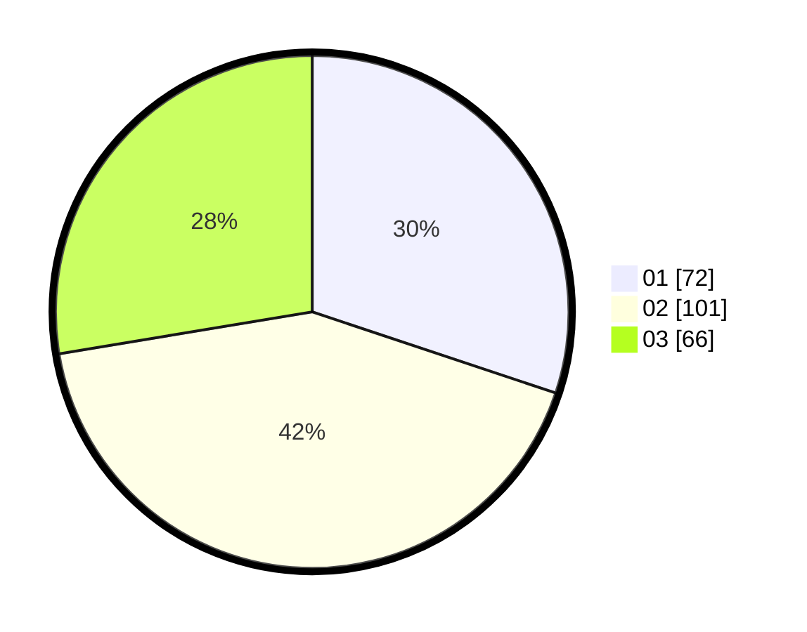

# Hasil

Hasil perolehan suara paslon dapat dilihat pada file paslon-01.txt, paslon-02.txt, dan paslon-03.txt.

Jika tidak ada, artinya data tersebut belum ada pada SIREKAP.

## Perolehan Suara

 * Paslon 01: **72**.
 * Paslon 02: **101**.
 * Paslon 03: **66**.

## Foto C Plano

https://sirekap-obj-formc.kpu.go.id/28ce/pemilu/ppwp/31/74/01/10/03/3174011003095-20240214-191131--8d098cc7-9a9d-4d80-b3ce-dee7830715bd.jpg

https://sirekap-obj-formc.kpu.go.id/28ce/pemilu/ppwp/31/74/01/10/03/3174011003095-20240214-191232--217b24ae-66e8-4338-9ee6-8d0e9a50ec86.jpg

https://sirekap-obj-formc.kpu.go.id/28ce/pemilu/ppwp/31/74/01/10/03/3174011003095-20240214-191444--ee544b9d-2867-4595-b90d-97066966c29b.jpg

## DATA PEMILIH TETAP

Jumlah pemilih dalam DPT: **269**.
 * L: **115**.
 * P: **154**.

## DATA PENGGUNA HAK PILIH

Jumlah pengguna hak pilih dalam DPT: **215**.
 * L: **95**.
 * P: **120**.

Jumlah pengguna hak pilih dalam DPTb: **13**.
 * L: **7**.
 * P: **6**.

Jumlah pengguna hak pilih dalam DPK: **13**.
 * L: **6**.
 * P: **7**.

Jumlah pengguna hak pilih: **241**.
 * L: **108**.
 * P: **133**.

## JUMLAH SUARA SAH DAN TIDAK SAH

JUMLAH SELURUH SUARA SAH: **239**.

JUMLAH SUARA TIDAK SAH: **2**.

JUMLAH SELURUH SUARA SAH DAN SUARA TIDAK SAH: **241**.
