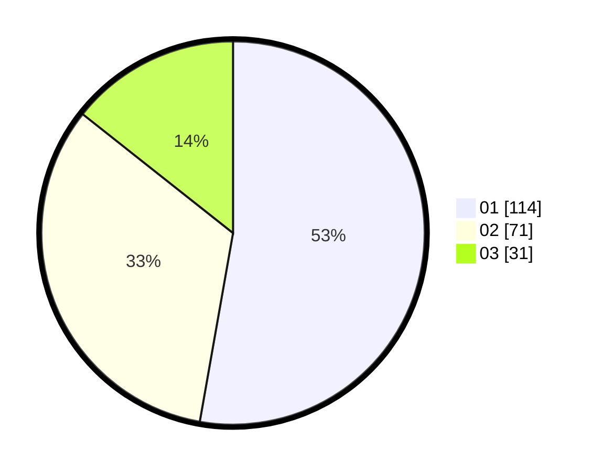

# Hasil

Hasil perolehan suara paslon dapat dilihat pada file paslon-01.txt, paslon-02.txt, dan paslon-03.txt.

Jika tidak ada, artinya data tersebut belum ada pada SIREKAP.

## Perolehan Suara

 * Paslon 01: **114**.
 * Paslon 02: **71**.
 * Paslon 03: **31**.

## Foto C Plano

https://sirekap-obj-formc.kpu.go.id/c9cf/pemilu/ppwp/31/74/01/10/03/3174011003104-20240214-190351--f31d91e4-85b9-41cd-bef3-7447cd981cc5.jpg

https://sirekap-obj-formc.kpu.go.id/c9cf/pemilu/ppwp/31/74/01/10/03/3174011003104-20240215-024222--05854673-61d9-455d-8c22-a403eda28aee.jpg

https://sirekap-obj-formc.kpu.go.id/c9cf/pemilu/ppwp/31/74/01/10/03/3174011003104-20240215-024243--698f96d8-9856-4647-bf9f-6e0b8240c738.jpg

## DATA PEMILIH TETAP

Jumlah pemilih dalam DPT: **275**.
 * L: **141**.
 * P: **134**.

## DATA PENGGUNA HAK PILIH

Jumlah pengguna hak pilih dalam DPT: **219**.
 * L: **110**.
 * P: **109**.

Jumlah pengguna hak pilih dalam DPTb: **0**.
 * L: **0**.
 * P: **0**.

Jumlah pengguna hak pilih dalam DPK: **0**.
 * L: **0**.
 * P: **0**.

Jumlah pengguna hak pilih: **219**.
 * L: **110**.
 * P: **109**.

## JUMLAH SUARA SAH DAN TIDAK SAH

JUMLAH SELURUH SUARA SAH: **216**.

JUMLAH SUARA TIDAK SAH: **3**.

JUMLAH SELURUH SUARA SAH DAN SUARA TIDAK SAH: **219**.
