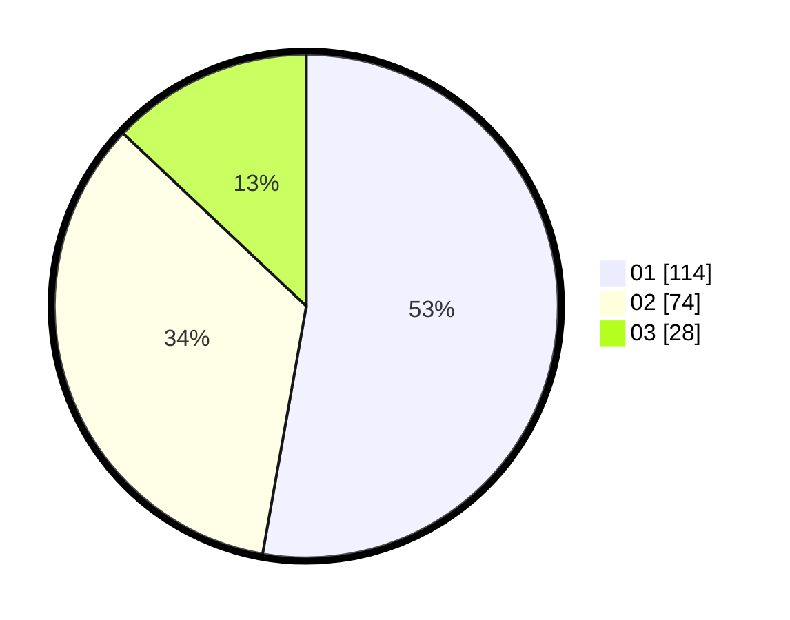

# Hasil

Hasil perolehan suara paslon dapat dilihat pada file paslon-01.txt, paslon-02.txt, dan paslon-03.txt.

Jika tidak ada, artinya data tersebut belum ada pada SIREKAP.

## Perolehan Suara

 * Paslon 01: **114**.
 * Paslon 02: **74**.
 * Paslon 03: **28**.

## Foto C Plano

https://sirekap-obj-formc.kpu.go.id/e8a3/pemilu/ppwp/31/74/01/10/03/3174011003108-20240214-225019--cdb12055-b4f9-4e5c-a774-8e6df73a31ec.jpg

https://sirekap-obj-formc.kpu.go.id/e8a3/pemilu/ppwp/31/74/01/10/03/3174011003108-20240217-192722--53633b94-e96e-4ba9-8c39-7a04e47e4845.jpg

https://sirekap-obj-formc.kpu.go.id/e8a3/pemilu/ppwp/31/74/01/10/03/3174011003108-20240217-192415--dc6465ce-e653-4ab7-af9f-6fbee8e4ac6f.jpg
