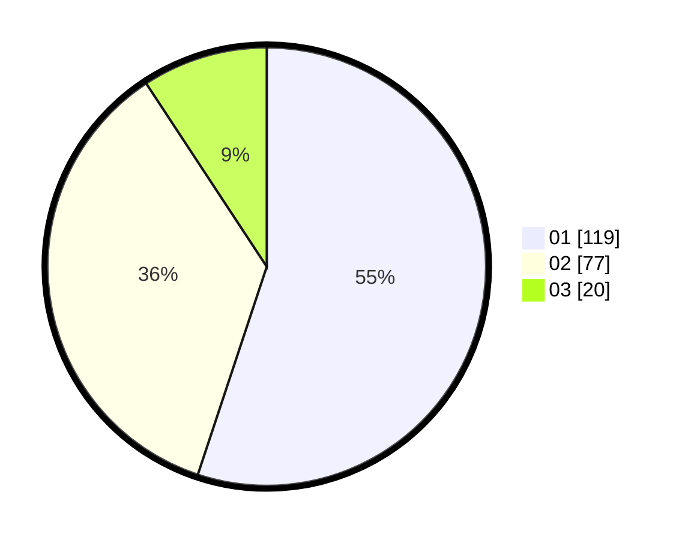

# Hasil

Hasil perolehan suara paslon dapat dilihat pada file paslon-01.txt, paslon-02.txt, dan paslon-03.txt.

Jika tidak ada, artinya data tersebut belum ada pada SIREKAP.

## Perolehan Suara

 * Paslon 01: **119**.
 * Paslon 02: **77**.
 * Paslon 03: **20**.

## Foto C Plano

https://sirekap-obj-formc.kpu.go.id/f59b/pemilu/ppwp/31/74/01/10/03/3174011003111-20240214-160100--19138a88-cd05-476d-b8da-219700dd4388.jpg

https://sirekap-obj-formc.kpu.go.id/f59b/pemilu/ppwp/31/74/01/10/03/3174011003111-20240214-155838--b34d9060-5c71-4586-ba63-e9fc2cab4038.jpg

https://sirekap-obj-formc.kpu.go.id/f59b/pemilu/ppwp/31/74/01/10/03/3174011003111-20240214-192240--f760e41b-3576-4bce-965e-50c532ea5af3.jpg

## DATA PEMILIH TETAP

Jumlah pemilih dalam DPT: **262**.
 * L: **136**.
 * P: **162**.

## DATA PENGGUNA HAK PILIH

Jumlah pengguna hak pilih dalam DPT: **205**.
 * L: **106**.
 * P: **109**.

Jumlah pengguna hak pilih dalam DPTb: **0**.
 * L: **0**.
 * P: **0**.

Jumlah pengguna hak pilih dalam DPK: **4**.
 * L: **2**.
 * P: **2**.

Jumlah pengguna hak pilih: **0**.
 * L: **108**.
 * P: **111**.

## JUMLAH SUARA SAH DAN TIDAK SAH

JUMLAH SELURUH SUARA SAH: **216**.

JUMLAH SUARA TIDAK SAH: **3**.

JUMLAH SELURUH SUARA SAH DAN SUARA TIDAK SAH: **219**.
