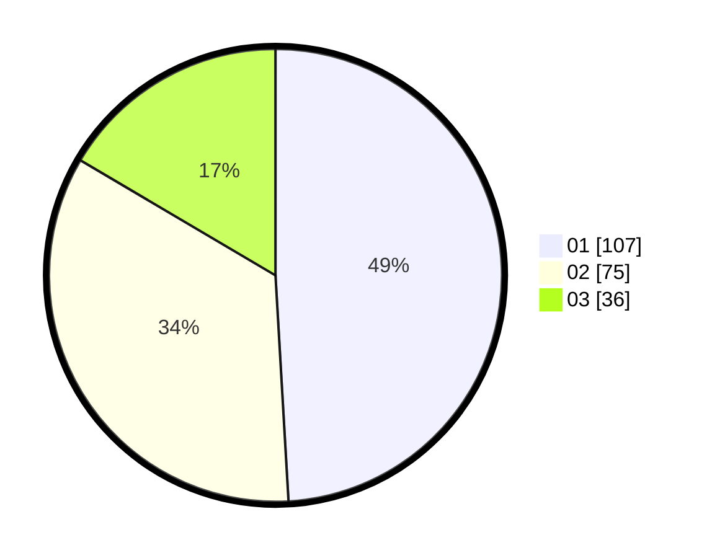

# Hasil

Hasil perolehan suara paslon dapat dilihat pada file paslon-01.txt, paslon-02.txt, dan paslon-03.txt.

Jika tidak ada, artinya data tersebut belum ada pada SIREKAP.

## Perolehan Suara

 * Paslon 01: **107**.
 * Paslon 02: **75**.
 * Paslon 03: **36**.

## Foto C Plano

https://sirekap-obj-formc.kpu.go.id/366e/pemilu/ppwp/31/74/01/10/03/3174011003119-20240214-201757--6cde48fb-6356-4ca9-8b4f-c8ff4005fa9b.jpg

https://sirekap-obj-formc.kpu.go.id/366e/pemilu/ppwp/31/74/01/10/03/3174011003119-20240214-193356--e52518d3-d6bc-4d93-a446-029d5f2e4628.jpg

https://sirekap-obj-formc.kpu.go.id/366e/pemilu/ppwp/31/74/01/10/03/3174011003119-20240214-193407--c1981f6a-6cac-4437-8f25-96eed4bb0bec.jpg

## DATA PEMILIH TETAP

Jumlah pemilih dalam DPT: **278**.
 * L: **137**.
 * P: **141**.

## DATA PENGGUNA HAK PILIH

Jumlah pengguna hak pilih dalam DPT: **202**.
 * L: **95**.
 * P: **107**.

Jumlah pengguna hak pilih dalam DPTb: **10**.
 * L: **3**.
 * P: **7**.

Jumlah pengguna hak pilih dalam DPK: **8**.
 * L: **7**.
 * P: **1**.

Jumlah pengguna hak pilih: **220**.
 * L: **105**.
 * P: **115**.

## JUMLAH SUARA SAH DAN TIDAK SAH

JUMLAH SELURUH SUARA SAH: **218**.

JUMLAH SUARA TIDAK SAH: **2**.

JUMLAH SELURUH SUARA SAH DAN SUARA TIDAK SAH: **220**.
