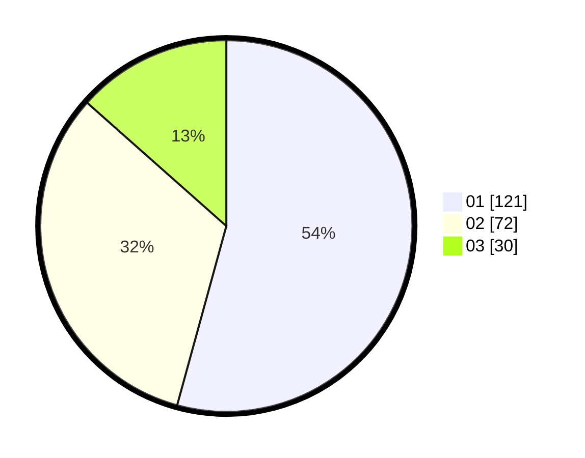

# Hasil

Hasil perolehan suara paslon dapat dilihat pada file paslon-01.txt, paslon-02.txt, dan paslon-03.txt.

Jika tidak ada, artinya data tersebut belum ada pada SIREKAP.

## Perolehan Suara

 * Paslon 01: **121**.
 * Paslon 02: **72**.
 * Paslon 03: **30**.

## Foto C Plano

https://sirekap-obj-formc.kpu.go.id/f33a/pemilu/ppwp/31/74/01/10/03/3174011003122-20240216-022107--e65edb58-e180-47d8-9a34-d8493d502d50.jpg

https://sirekap-obj-formc.kpu.go.id/f33a/pemilu/ppwp/31/74/01/10/03/3174011003122-20240216-020048--a943bfb3-e819-4ca9-a498-4888ecf4e8c4.jpg

https://sirekap-obj-formc.kpu.go.id/f33a/pemilu/ppwp/31/74/01/10/03/3174011003122-20240216-020225--10085c27-8368-4458-a96c-6ab00cf9f214.jpg

## DATA PEMILIH TETAP

Jumlah pemilih dalam DPT: **263**.
 * L: **131**.
 * P: **132**.

## DATA PENGGUNA HAK PILIH

Jumlah pengguna hak pilih dalam DPT: **223**.
 * L: **106**.
 * P: **117**.

Jumlah pengguna hak pilih dalam DPTb: **2**.
 * L: **1**.
 * P: **1**.

Jumlah pengguna hak pilih dalam DPK: **1**.
 * L: **1**.
 * P: **0**.

Jumlah pengguna hak pilih: **226**.
 * L: **108**.
 * P: **118**.

## JUMLAH SUARA SAH DAN TIDAK SAH

JUMLAH SELURUH SUARA SAH: **223**.

JUMLAH SUARA TIDAK SAH: **3**.

JUMLAH SELURUH SUARA SAH DAN SUARA TIDAK SAH: **226**.
