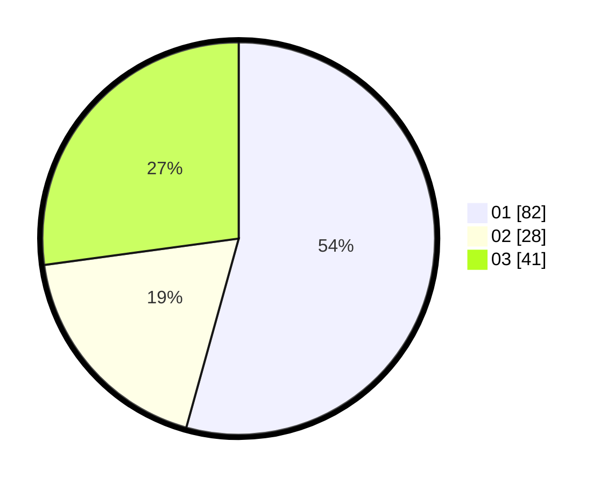

# Hasil

Hasil perolehan suara paslon dapat dilihat pada file paslon-01.txt, paslon-02.txt, dan paslon-03.txt.

Jika tidak ada, artinya data tersebut belum ada pada SIREKAP.

## Perolehan Suara

 * Paslon 01: **82**.
 * Paslon 02: **28**.
 * Paslon 03: **41**.

## Foto C Plano

https://sirekap-obj-formc.kpu.go.id/765b/pemilu/ppwp/31/74/01/10/03/3174011003129-20240214-190543--3de3bf4c-beb8-40a5-b13b-748e31ba2342.jpg

https://sirekap-obj-formc.kpu.go.id/765b/pemilu/ppwp/31/74/01/10/03/3174011003129-20240214-193243--4c6c142b-b666-41b9-8f8a-2bc0dec7c606.jpg

https://sirekap-obj-formc.kpu.go.id/765b/pemilu/ppwp/31/74/01/10/03/3174011003129-20240214-194349--dd7fe8db-3cb3-42d4-9318-2e977ad42f50.jpg

## DATA PEMILIH TETAP

Jumlah pemilih dalam DPT: **152**.
 * L: **73**.
 * P: **79**.

## DATA PENGGUNA HAK PILIH

Jumlah pengguna hak pilih dalam DPT: **129**.
 * L: **60**.
 * P: **69**.

Jumlah pengguna hak pilih dalam DPTb: **23**.
 * L: **8**.
 * P: **15**.

Jumlah pengguna hak pilih dalam DPK: **1**.
 * L: **0**.
 * P: **1**.

Jumlah pengguna hak pilih: **153**.
 * L: **68**.
 * P: **85**.

## JUMLAH SUARA SAH DAN TIDAK SAH

JUMLAH SELURUH SUARA SAH: **151**.

JUMLAH SUARA TIDAK SAH: **2**.

JUMLAH SELURUH SUARA SAH DAN SUARA TIDAK SAH: **153**.
