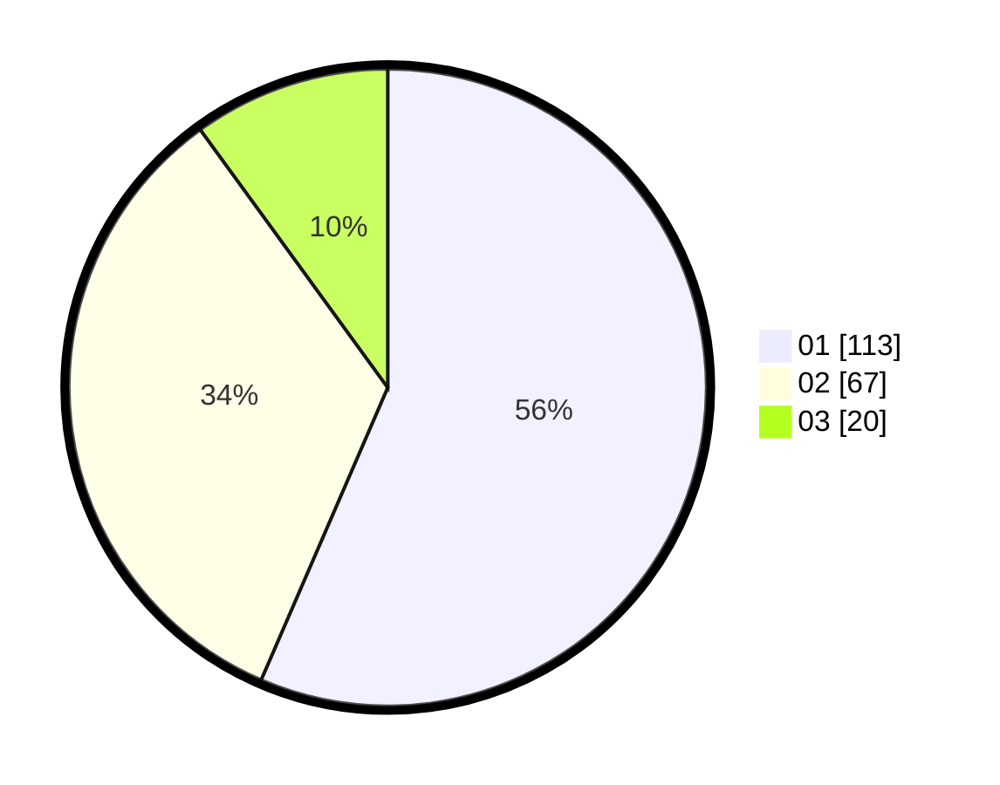

# Hasil

Hasil perolehan suara paslon dapat dilihat pada file paslon-01.txt, paslon-02.txt, dan paslon-03.txt.

Jika tidak ada, artinya data tersebut belum ada pada SIREKAP.

## Perolehan Suara

 * Paslon 01: **113**.
 * Paslon 02: **67**.
 * Paslon 03: **20**.

## Foto C Plano

https://sirekap-obj-formc.kpu.go.id/84d7/pemilu/ppwp/31/74/01/10/04/3174011004012-20240214-155239--67d5b08d-763b-4e3e-ab4d-8fe800dc0b14.jpg

https://sirekap-obj-formc.kpu.go.id/84d7/pemilu/ppwp/31/74/01/10/04/3174011004012-20240214-155503--9d3bf051-02f2-4dec-a26a-fa6cabe62359.jpg

https://sirekap-obj-formc.kpu.go.id/84d7/pemilu/ppwp/31/74/01/10/04/3174011004012-20240214-160135--a5435706-f082-40fc-b2c9-1dbbcdc30c1f.jpg

## DATA PEMILIH TETAP

Jumlah pemilih dalam DPT: **249**.
 * L: **125**.
 * P: **124**.

## DATA PENGGUNA HAK PILIH

Jumlah pengguna hak pilih dalam DPT: **198**.
 * L: **84**.
 * P: **114**.

Jumlah pengguna hak pilih dalam DPTb: **10**.
 * L: **9**.
 * P: **1**.

Jumlah pengguna hak pilih dalam DPK: **0**.
 * L: **0**.
 * P: **0**.

Jumlah pengguna hak pilih: **208**.
 * L: **93**.
 * P: **115**.

## JUMLAH SUARA SAH DAN TIDAK SAH

JUMLAH SELURUH SUARA SAH: **200**.

JUMLAH SUARA TIDAK SAH: **8**.

JUMLAH SELURUH SUARA SAH DAN SUARA TIDAK SAH: **208**.
