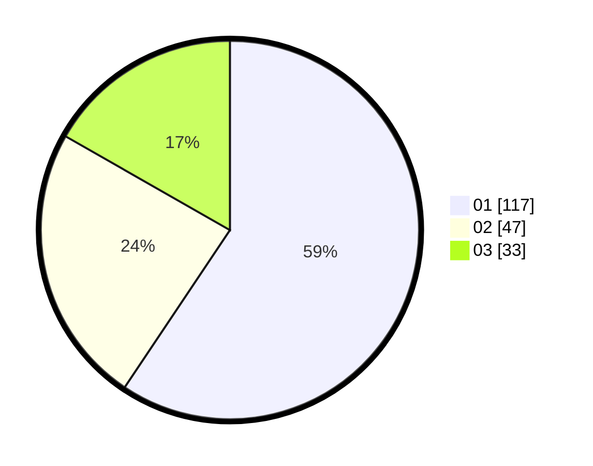

# Hasil

Hasil perolehan suara paslon dapat dilihat pada file paslon-01.txt, paslon-02.txt, dan paslon-03.txt.

Jika tidak ada, artinya data tersebut belum ada pada SIREKAP.

## Perolehan Suara

 * Paslon 01: **117**.
 * Paslon 02: **47**.
 * Paslon 03: **33**.

## Foto C Plano

https://sirekap-obj-formc.kpu.go.id/861b/pemilu/ppwp/31/74/01/10/04/3174011004014-20240214-210906--0117d27e-c259-4ad4-a63b-240b87be501f.jpg

https://sirekap-obj-formc.kpu.go.id/861b/pemilu/ppwp/31/74/01/10/04/3174011004014-20240214-213917--d8b50ca1-fc70-4da6-b9b2-c57379098d22.jpg

https://sirekap-obj-formc.kpu.go.id/861b/pemilu/ppwp/31/74/01/10/04/3174011004014-20240214-202356--d4ca0754-08c1-4c36-9d70-e7bd7a874e8f.jpg
