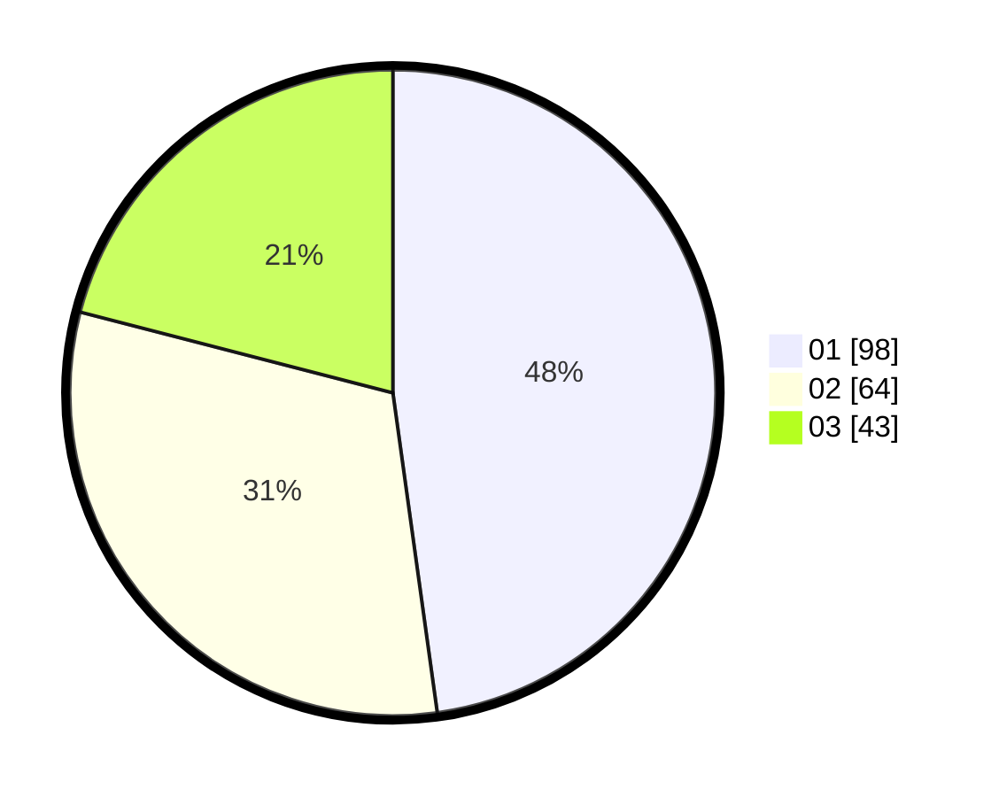

# Hasil

Hasil perolehan suara paslon dapat dilihat pada file paslon-01.txt, paslon-02.txt, dan paslon-03.txt.

Jika tidak ada, artinya data tersebut belum ada pada SIREKAP.

## Perolehan Suara

 * Paslon 01: **98**.
 * Paslon 02: **64**.
 * Paslon 03: **43**.

## Foto C Plano

https://sirekap-obj-formc.kpu.go.id/299d/pemilu/ppwp/31/74/01/10/04/3174011004015-20240214-190156--1591b262-f8bc-4d27-9c47-f273739743e1.jpg

https://sirekap-obj-formc.kpu.go.id/299d/pemilu/ppwp/31/74/01/10/04/3174011004015-20240214-190303--d96348a5-1fe3-478d-90b0-f3b286539e68.jpg

https://sirekap-obj-formc.kpu.go.id/299d/pemilu/ppwp/31/74/01/10/04/3174011004015-20240215-230645--b11266ca-e95e-4371-b6db-8256af0eac65.jpg

## DATA PEMILIH TETAP

Jumlah pemilih dalam DPT: **267**.
 * L: **134**.
 * P: **133**.

## DATA PENGGUNA HAK PILIH

Jumlah pengguna hak pilih dalam DPT: **203**.
 * L: **98**.
 * P: **105**.

Jumlah pengguna hak pilih dalam DPTb: **4**.
 * L: **3**.
 * P: **1**.

Jumlah pengguna hak pilih dalam DPK: **1**.
 * L: **0**.
 * P: **1**.

Jumlah pengguna hak pilih: **208**.
 * L: **101**.
 * P: **107**.

## JUMLAH SUARA SAH DAN TIDAK SAH

JUMLAH SELURUH SUARA SAH: **205**.

JUMLAH SUARA TIDAK SAH: **3**.

JUMLAH SELURUH SUARA SAH DAN SUARA TIDAK SAH: **208**.
