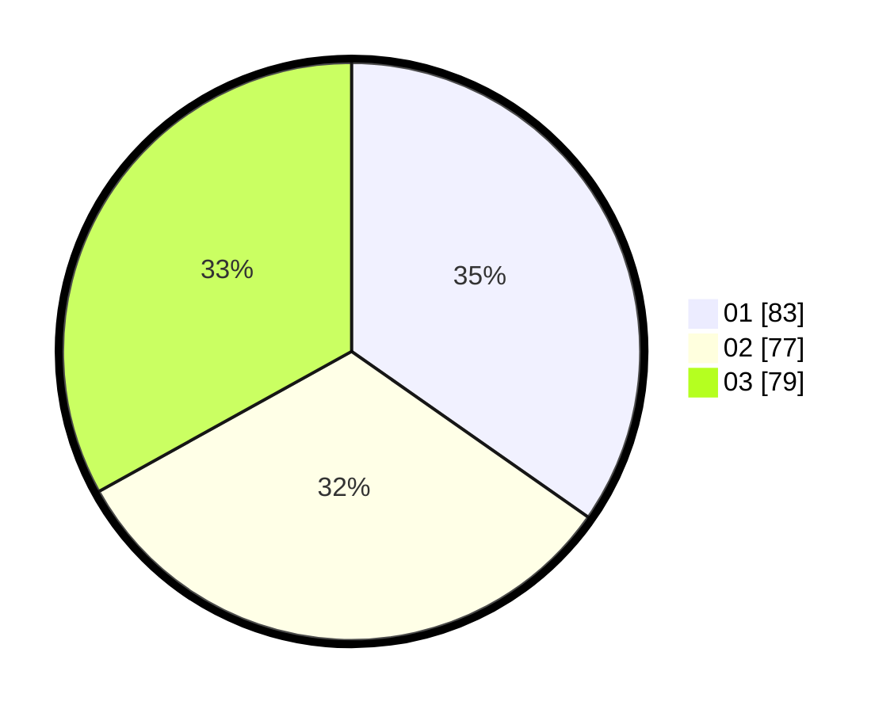

# Hasil

Hasil perolehan suara paslon dapat dilihat pada file paslon-01.txt, paslon-02.txt, dan paslon-03.txt.

Jika tidak ada, artinya data tersebut belum ada pada SIREKAP.

## Perolehan Suara

 * Paslon 01: **83**.
 * Paslon 02: **77**.
 * Paslon 03: **79**.

## Foto C Plano

https://sirekap-obj-formc.kpu.go.id/9d77/pemilu/ppwp/31/74/01/10/04/3174011004021-20240214-155125--53898130-490f-4a7e-b126-2272b002f27c.jpg

https://sirekap-obj-formc.kpu.go.id/9d77/pemilu/ppwp/31/74/01/10/04/3174011004021-20240214-155234--433bdd35-34c9-4c43-b6b8-8425a876662e.jpg

https://sirekap-obj-formc.kpu.go.id/9d77/pemilu/ppwp/31/74/01/10/04/3174011004021-20240214-155326--56ebda35-7f54-42e2-9951-13f8c7250b82.jpg

## DATA PEMILIH TETAP

Jumlah pemilih dalam DPT: **273**.
 * L: **138**.
 * P: **135**.

## DATA PENGGUNA HAK PILIH

Jumlah pengguna hak pilih dalam DPT: **224**.
 * L: **115**.
 * P: **109**.

Jumlah pengguna hak pilih dalam DPTb: **18**.
 * L: **9**.
 * P: **9**.

Jumlah pengguna hak pilih dalam DPK: **0**.
 * L: **0**.
 * P: **0**.

Jumlah pengguna hak pilih: **242**.
 * L: **124**.
 * P: **118**.

## JUMLAH SUARA SAH DAN TIDAK SAH

JUMLAH SELURUH SUARA SAH: **239**.

JUMLAH SUARA TIDAK SAH: **3**.

JUMLAH SELURUH SUARA SAH DAN SUARA TIDAK SAH: **242**.
