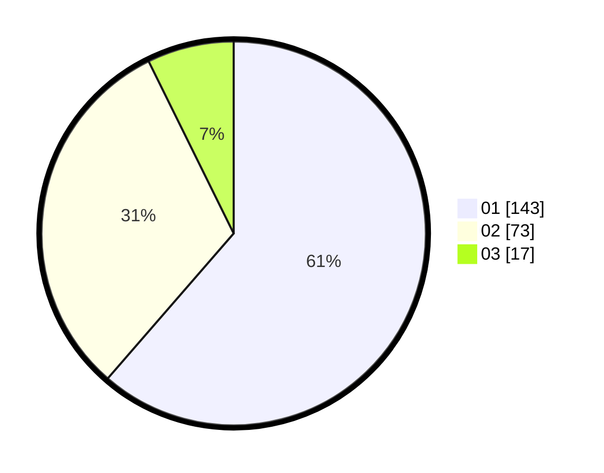

# Hasil

Hasil perolehan suara paslon dapat dilihat pada file paslon-01.txt, paslon-02.txt, dan paslon-03.txt.

Jika tidak ada, artinya data tersebut belum ada pada SIREKAP.

## Perolehan Suara

 * Paslon 01: **143**.
 * Paslon 02: **73**.
 * Paslon 03: **17**.

## Foto C Plano

https://sirekap-obj-formc.kpu.go.id/64fb/pemilu/ppwp/31/74/01/10/04/3174011004040-20240215-044530--7cc55d22-5dc3-460e-999c-c21af3b3c900.jpg

https://sirekap-obj-formc.kpu.go.id/64fb/pemilu/ppwp/31/74/01/10/04/3174011004040-20240215-044552--78fede9c-c633-4bc7-af1d-ec7babb9a120.jpg

https://sirekap-obj-formc.kpu.go.id/64fb/pemilu/ppwp/31/74/01/10/04/3174011004040-20240215-044541--d1096a93-e45c-4460-a07b-eb2ad350138f.jpg

## DATA PEMILIH TETAP

Jumlah pemilih dalam DPT: **268**.
 * L: **129**.
 * P: **139**.

## DATA PENGGUNA HAK PILIH

Jumlah pengguna hak pilih dalam DPT: **218**.
 * L: **103**.
 * P: **115**.

Jumlah pengguna hak pilih dalam DPTb: **16**.
 * L: **3**.
 * P: **13**.

Jumlah pengguna hak pilih dalam DPK: **0**.
 * L: **0**.
 * P: **0**.

Jumlah pengguna hak pilih: **234**.
 * L: **106**.
 * P: **128**.

## JUMLAH SUARA SAH DAN TIDAK SAH

JUMLAH SELURUH SUARA SAH: **233**.

JUMLAH SUARA TIDAK SAH: **1**.

JUMLAH SELURUH SUARA SAH DAN SUARA TIDAK SAH: **234**.
