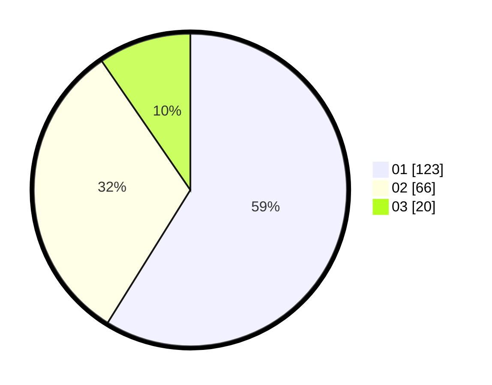

# Hasil

Hasil perolehan suara paslon dapat dilihat pada file paslon-01.txt, paslon-02.txt, dan paslon-03.txt.

Jika tidak ada, artinya data tersebut belum ada pada SIREKAP.

## Perolehan Suara

 * Paslon 01: **123**.
 * Paslon 02: **66**.
 * Paslon 03: **20**.

## Foto C Plano

https://sirekap-obj-formc.kpu.go.id/e953/pemilu/ppwp/31/74/01/10/04/3174011004044-20240214-155721--f01af265-d82f-4bca-af32-e037e34e3dd4.jpg

https://sirekap-obj-formc.kpu.go.id/e953/pemilu/ppwp/31/74/01/10/04/3174011004044-20240214-155817--27de552f-da7e-452b-b233-62b8bbc92764.jpg

https://sirekap-obj-formc.kpu.go.id/e953/pemilu/ppwp/31/74/01/10/04/3174011004044-20240214-155905--4f9ba777-2e89-427c-86e2-b20c5e391c21.jpg

## DATA PEMILIH TETAP

Jumlah pemilih dalam DPT: **267**.
 * L: **130**.
 * P: **137**.

## DATA PENGGUNA HAK PILIH

Jumlah pengguna hak pilih dalam DPT: **209**.
 * L: **98**.
 * P: **111**.

Jumlah pengguna hak pilih dalam DPTb: **2**.
 * L: **1**.
 * P: **1**.

Jumlah pengguna hak pilih dalam DPK: **0**.
 * L: **0**.
 * P: **0**.

Jumlah pengguna hak pilih: **211**.
 * L: **99**.
 * P: **112**.

## JUMLAH SUARA SAH DAN TIDAK SAH

JUMLAH SELURUH SUARA SAH: **209**.

JUMLAH SUARA TIDAK SAH: **2**.

JUMLAH SELURUH SUARA SAH DAN SUARA TIDAK SAH: **211**.
