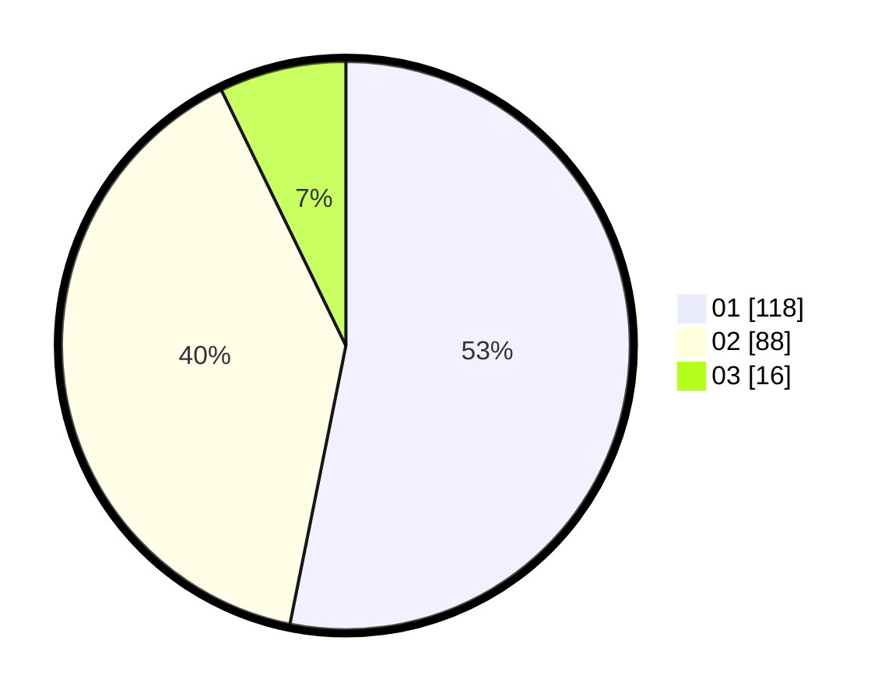

# Hasil

Hasil perolehan suara paslon dapat dilihat pada file paslon-01.txt, paslon-02.txt, dan paslon-03.txt.

Jika tidak ada, artinya data tersebut belum ada pada SIREKAP.

## Perolehan Suara

 * Paslon 01: **118**.
 * Paslon 02: **88**.
 * Paslon 03: **16**.

## Foto C Plano

https://sirekap-obj-formc.kpu.go.id/83bc/pemilu/ppwp/31/74/01/10/04/3174011004046-20240214-185450--e92cab66-1af1-404f-abef-9abf2a574054.jpg

https://sirekap-obj-formc.kpu.go.id/83bc/pemilu/ppwp/31/74/01/10/04/3174011004046-20240214-185509--19202a8f-9c9a-4d83-818f-4e61b8cf5828.jpg

https://sirekap-obj-formc.kpu.go.id/83bc/pemilu/ppwp/31/74/01/10/04/3174011004046-20240214-155844--0b70945a-0e0f-41a7-ae4e-a37e54eb5b0b.jpg

## DATA PEMILIH TETAP

Jumlah pemilih dalam DPT: **269**.
 * L: **132**.
 * P: **137**.

## DATA PENGGUNA HAK PILIH

Jumlah pengguna hak pilih dalam DPT: **217**.
 * L: **104**.
 * P: **113**.

Jumlah pengguna hak pilih dalam DPTb: **5**.
 * L: **2**.
 * P: **3**.

Jumlah pengguna hak pilih dalam DPK: **2**.
 * L: **1**.
 * P: **1**.

Jumlah pengguna hak pilih: **224**.
 * L: **107**.
 * P: **117**.

## JUMLAH SUARA SAH DAN TIDAK SAH

JUMLAH SELURUH SUARA SAH: **222**.

JUMLAH SUARA TIDAK SAH: **2**.

JUMLAH SELURUH SUARA SAH DAN SUARA TIDAK SAH: **224**.
