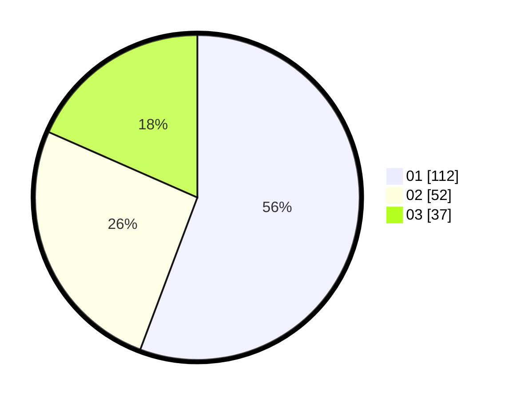

# Hasil

Hasil perolehan suara paslon dapat dilihat pada file paslon-01.txt, paslon-02.txt, dan paslon-03.txt.

Jika tidak ada, artinya data tersebut belum ada pada SIREKAP.

## Perolehan Suara

 * Paslon 01: **112**.
 * Paslon 02: **52**.
 * Paslon 03: **37**.

## Foto C Plano

https://sirekap-obj-formc.kpu.go.id/51b0/pemilu/ppwp/31/74/01/10/04/3174011004050-20240215-003353--4b3662c0-b7c1-4915-8e0f-808614466d0e.jpg

https://sirekap-obj-formc.kpu.go.id/51b0/pemilu/ppwp/31/74/01/10/04/3174011004050-20240215-003656--6c8f4490-6709-45d5-9d67-138fd0a865a0.jpg

https://sirekap-obj-formc.kpu.go.id/51b0/pemilu/ppwp/31/74/01/10/04/3174011004050-20240215-003837--b88557ff-ef03-4b90-86f1-f1a380f89fe9.jpg

## DATA PEMILIH TETAP

Jumlah pemilih dalam DPT: **258**.
 * L: **125**.
 * P: **133**.

## DATA PENGGUNA HAK PILIH

Jumlah pengguna hak pilih dalam DPT: **204**.
 * L: **93**.
 * P: **111**.

Jumlah pengguna hak pilih dalam DPTb: **0**.
 * L: **0**.
 * P: **0**.

Jumlah pengguna hak pilih dalam DPK: **1**.
 * L: **0**.
 * P: **1**.

Jumlah pengguna hak pilih: **205**.
 * L: **93**.
 * P: **112**.

## JUMLAH SUARA SAH DAN TIDAK SAH

JUMLAH SELURUH SUARA SAH: **201**.

JUMLAH SUARA TIDAK SAH: **5**.

JUMLAH SELURUH SUARA SAH DAN SUARA TIDAK SAH: **206**.
