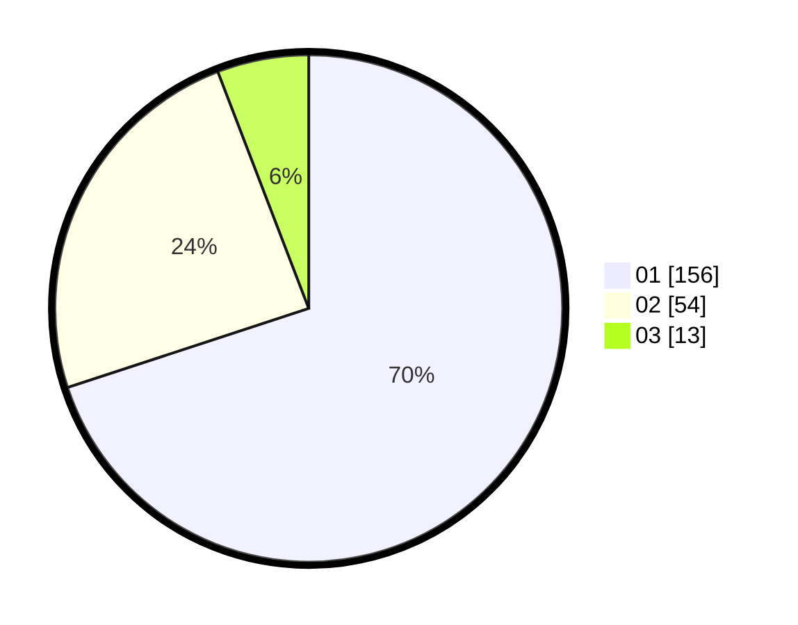

# Hasil

Hasil perolehan suara paslon dapat dilihat pada file paslon-01.txt, paslon-02.txt, dan paslon-03.txt.

Jika tidak ada, artinya data tersebut belum ada pada SIREKAP.

## Perolehan Suara

 * Paslon 01: **156**.
 * Paslon 02: **54**.
 * Paslon 03: **13**.

## Foto C Plano

https://sirekap-obj-formc.kpu.go.id/ecae/pemilu/ppwp/31/74/01/10/04/3174011004056-20240217-104137--962ff69b-3067-4f6b-b090-796b6ba97e9e.jpg

https://sirekap-obj-formc.kpu.go.id/ecae/pemilu/ppwp/31/74/01/10/04/3174011004056-20240217-104035--996dc937-2819-4577-b9d4-b318d2901bd7.jpg

https://sirekap-obj-formc.kpu.go.id/ecae/pemilu/ppwp/31/74/01/10/04/3174011004056-20240217-104829--cc37210a-e6e0-4e39-8a8f-89eb9b838d8b.jpg

## DATA PEMILIH TETAP

Jumlah pemilih dalam DPT: **261**.
 * L: **123**.
 * P: **138**.

## DATA PENGGUNA HAK PILIH

Jumlah pengguna hak pilih dalam DPT: **218**.
 * L: **100**.
 * P: **118**.

Jumlah pengguna hak pilih dalam DPTb: **4**.
 * L: **1**.
 * P: **3**.

Jumlah pengguna hak pilih dalam DPK: **1**.
 * L: **0**.
 * P: **1**.

Jumlah pengguna hak pilih: **223**.
 * L: **101**.
 * P: **122**.

## JUMLAH SUARA SAH DAN TIDAK SAH

JUMLAH SELURUH SUARA SAH: **223**.

JUMLAH SUARA TIDAK SAH: **0**.

JUMLAH SELURUH SUARA SAH DAN SUARA TIDAK SAH: **223**.
