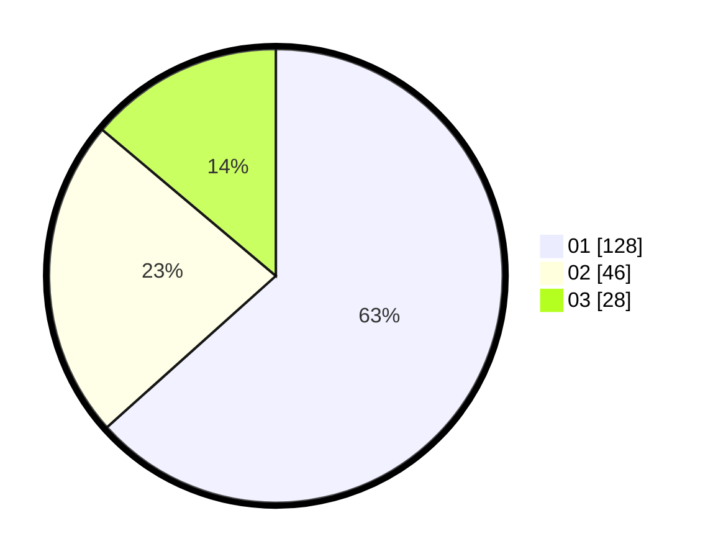

# Hasil

Hasil perolehan suara paslon dapat dilihat pada file paslon-01.txt, paslon-02.txt, dan paslon-03.txt.

Jika tidak ada, artinya data tersebut belum ada pada SIREKAP.

## Perolehan Suara

 * Paslon 01: **128**.
 * Paslon 02: **46**.
 * Paslon 03: **28**.

## Foto C Plano

https://sirekap-obj-formc.kpu.go.id/20bf/pemilu/ppwp/31/74/01/10/04/3174011004057-20240214-155841--11a59017-bce2-41bc-ad75-8331c8e3d11c.jpg

https://sirekap-obj-formc.kpu.go.id/20bf/pemilu/ppwp/31/74/01/10/04/3174011004057-20240214-160056--1cb4b0f3-2350-4c21-be25-f4eafc2b27c4.jpg

https://sirekap-obj-formc.kpu.go.id/20bf/pemilu/ppwp/31/74/01/10/04/3174011004057-20240214-160136--d4e1fd50-87c6-4b06-855d-dce142b40d27.jpg

## DATA PEMILIH TETAP

Jumlah pemilih dalam DPT: **259**.
 * L: **135**.
 * P: **124**.

## DATA PENGGUNA HAK PILIH

Jumlah pengguna hak pilih dalam DPT: **258**.
 * L: **135**.
 * P: **123**.

Jumlah pengguna hak pilih dalam DPTb: **1**.
 * L: **0**.
 * P: **1**.

Jumlah pengguna hak pilih dalam DPK: **0**.
 * L: **0**.
 * P: **0**.

Jumlah pengguna hak pilih: **259**.
 * L: **135**.
 * P: **124**.

## JUMLAH SUARA SAH DAN TIDAK SAH

JUMLAH SELURUH SUARA SAH: **202**.

JUMLAH SUARA TIDAK SAH: **4**.

JUMLAH SELURUH SUARA SAH DAN SUARA TIDAK SAH: **206**.
