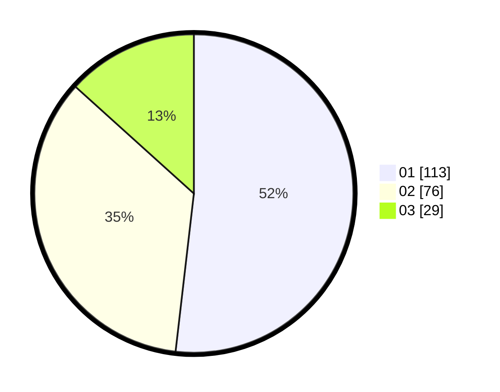

# Hasil

Hasil perolehan suara paslon dapat dilihat pada file paslon-01.txt, paslon-02.txt, dan paslon-03.txt.

Jika tidak ada, artinya data tersebut belum ada pada SIREKAP.

## Perolehan Suara

 * Paslon 01: **113**.
 * Paslon 02: **76**.
 * Paslon 03: **29**.

## Foto C Plano

https://sirekap-obj-formc.kpu.go.id/57b7/pemilu/ppwp/31/74/01/10/04/3174011004059-20240214-160106--61433a5b-48c1-4424-bfd2-b7dcfe9a442f.jpg

https://sirekap-obj-formc.kpu.go.id/57b7/pemilu/ppwp/31/74/01/10/04/3174011004059-20240214-231756--e3d272a2-d3c2-4766-8cef-f2e3491b016b.jpg

https://sirekap-obj-formc.kpu.go.id/57b7/pemilu/ppwp/31/74/01/10/04/3174011004059-20240215-165702--2c6bbfb2-84f3-4c24-85c0-2742df4eea49.jpg

## DATA PEMILIH TETAP

Jumlah pemilih dalam DPT: **262**.
 * L: **129**.
 * P: **133**.

## DATA PENGGUNA HAK PILIH

Jumlah pengguna hak pilih dalam DPT: **215**.
 * L: **103**.
 * P: **112**.

Jumlah pengguna hak pilih dalam DPTb: **1**.
 * L: **0**.
 * P: **1**.

Jumlah pengguna hak pilih dalam DPK: **3**.
 * L: **2**.
 * P: **1**.

Jumlah pengguna hak pilih: **219**.
 * L: **105**.
 * P: **114**.

## JUMLAH SUARA SAH DAN TIDAK SAH

JUMLAH SELURUH SUARA SAH: **218**.

JUMLAH SUARA TIDAK SAH: **1**.

JUMLAH SELURUH SUARA SAH DAN SUARA TIDAK SAH: **219**.
