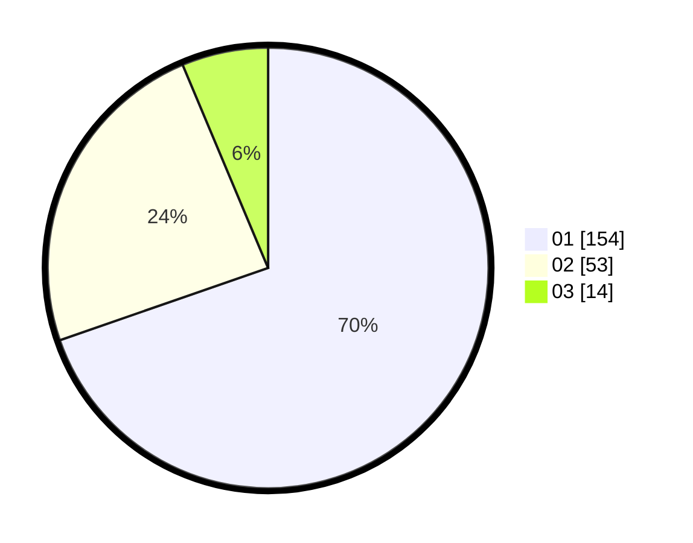

# Hasil

Hasil perolehan suara paslon dapat dilihat pada file paslon-01.txt, paslon-02.txt, dan paslon-03.txt.

Jika tidak ada, artinya data tersebut belum ada pada SIREKAP.

## Perolehan Suara

 * Paslon 01: **154**.
 * Paslon 02: **53**.
 * Paslon 03: **14**.

## Foto C Plano

https://sirekap-obj-formc.kpu.go.id/6071/pemilu/ppwp/31/74/01/10/04/3174011004060-20240214-155708--a3758c11-3b39-4f3c-b392-5fd5a0873647.jpg

https://sirekap-obj-formc.kpu.go.id/6071/pemilu/ppwp/31/74/01/10/04/3174011004060-20240214-155714--9aeec119-aaea-4924-a2fe-5a8bd2bc8469.jpg

https://sirekap-obj-formc.kpu.go.id/6071/pemilu/ppwp/31/74/01/10/04/3174011004060-20240214-155719--456bb66d-75b7-434c-beb8-071de94ea187.jpg

## DATA PEMILIH TETAP

Jumlah pemilih dalam DPT: **258**.
 * L: **113**.
 * P: **145**.

## DATA PENGGUNA HAK PILIH

Jumlah pengguna hak pilih dalam DPT: **220**.
 * L: **90**.
 * P: **130**.

Jumlah pengguna hak pilih dalam DPTb: **2**.
 * L: **1**.
 * P: **1**.

Jumlah pengguna hak pilih dalam DPK: **0**.
 * L: **0**.
 * P: **0**.

Jumlah pengguna hak pilih: **222**.
 * L: **91**.
 * P: **131**.

## JUMLAH SUARA SAH DAN TIDAK SAH

JUMLAH SELURUH SUARA SAH: **221**.

JUMLAH SUARA TIDAK SAH: **1**.

JUMLAH SELURUH SUARA SAH DAN SUARA TIDAK SAH: **222**.
