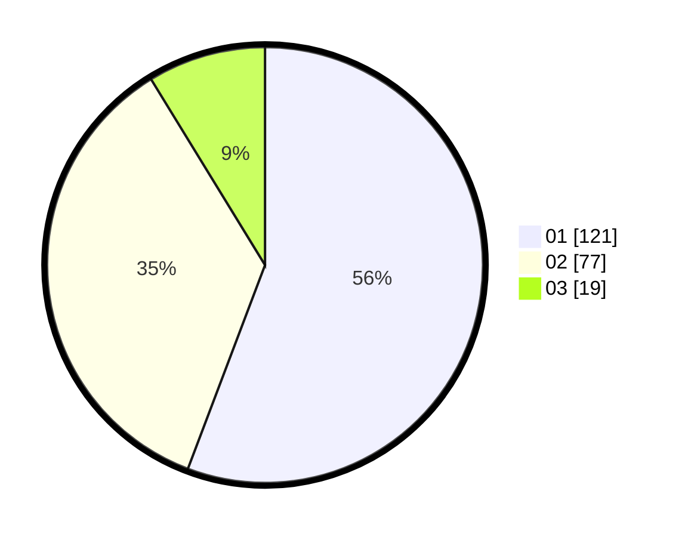

# Hasil

Hasil perolehan suara paslon dapat dilihat pada file paslon-01.txt, paslon-02.txt, dan paslon-03.txt.

Jika tidak ada, artinya data tersebut belum ada pada SIREKAP.

## Perolehan Suara

 * Paslon 01: **121**.
 * Paslon 02: **77**.
 * Paslon 03: **19**.

## Foto C Plano

https://sirekap-obj-formc.kpu.go.id/2c67/pemilu/ppwp/31/74/01/10/04/3174011004063-20240214-193754--b838316c-daba-40ec-9076-deed1418f029.jpg

https://sirekap-obj-formc.kpu.go.id/2c67/pemilu/ppwp/31/74/01/10/04/3174011004063-20240214-193801--efb35e0b-0088-49ce-a423-5d3a4b045b4f.jpg

https://sirekap-obj-formc.kpu.go.id/2c67/pemilu/ppwp/31/74/01/10/04/3174011004063-20240214-193807--d0b4b061-01ef-4d5e-aae4-ba663804860f.jpg

## DATA PEMILIH TETAP

Jumlah pemilih dalam DPT: **258**.
 * L: **128**.
 * P: **130**.

## DATA PENGGUNA HAK PILIH

Jumlah pengguna hak pilih dalam DPT: **214**.
 * L: **104**.
 * P: **110**.

Jumlah pengguna hak pilih dalam DPTb: **4**.
 * L: **3**.
 * P: **1**.

Jumlah pengguna hak pilih dalam DPK: **1**.
 * L: **0**.
 * P: **1**.

Jumlah pengguna hak pilih: **219**.
 * L: **107**.
 * P: **112**.

## JUMLAH SUARA SAH DAN TIDAK SAH

JUMLAH SELURUH SUARA SAH: **217**.

JUMLAH SUARA TIDAK SAH: **2**.

JUMLAH SELURUH SUARA SAH DAN SUARA TIDAK SAH: **219**.
