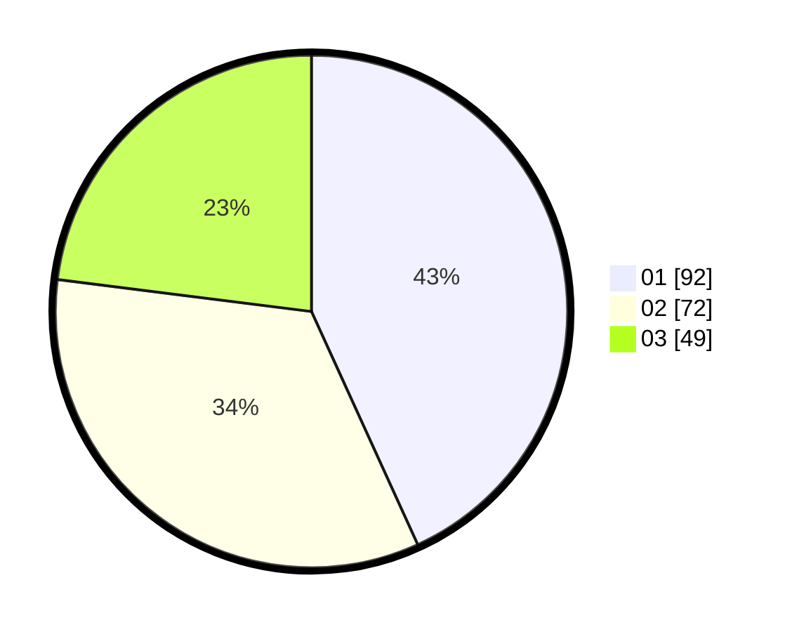

# Hasil

Hasil perolehan suara paslon dapat dilihat pada file paslon-01.txt, paslon-02.txt, dan paslon-03.txt.

Jika tidak ada, artinya data tersebut belum ada pada SIREKAP.

## Perolehan Suara

 * Paslon 01: **92**.
 * Paslon 02: **72**.
 * Paslon 03: **49**.

## Foto C Plano

https://sirekap-obj-formc.kpu.go.id/d122/pemilu/ppwp/31/74/01/10/04/3174011004073-20240214-190353--0d246de9-eb7b-48b3-bbdd-ba0528790d6b.jpg

https://sirekap-obj-formc.kpu.go.id/d122/pemilu/ppwp/31/74/01/10/04/3174011004073-20240214-190358--ada5c77c-5e0f-4e86-8095-c152188bad8c.jpg
