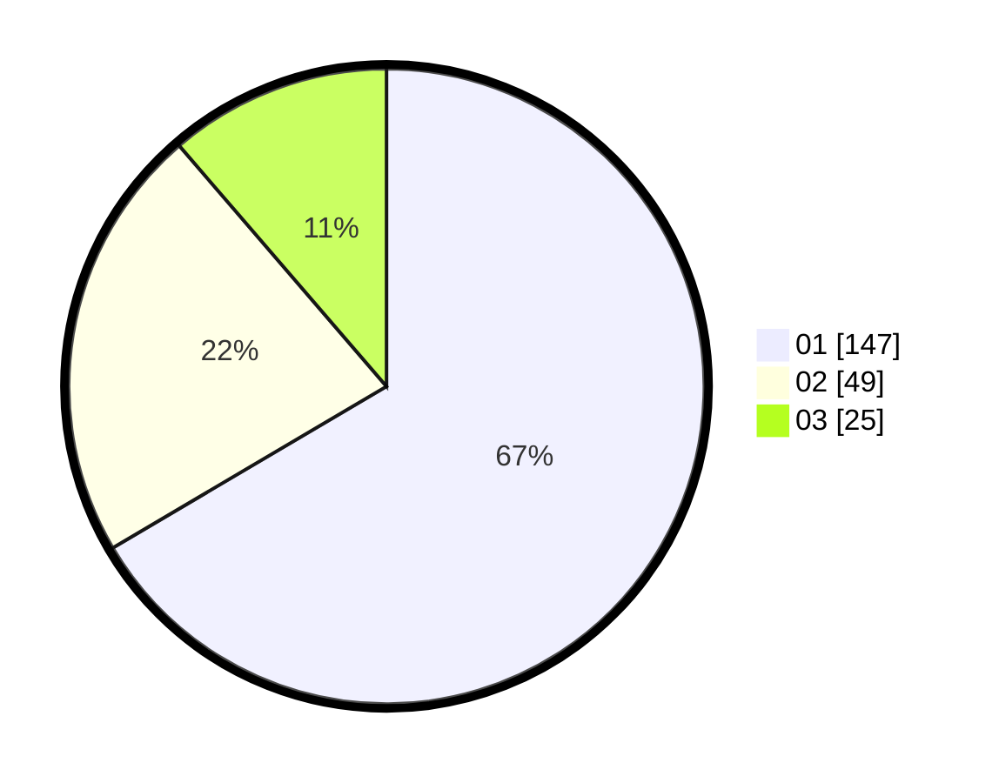

# Hasil

Hasil perolehan suara paslon dapat dilihat pada file paslon-01.txt, paslon-02.txt, dan paslon-03.txt.

Jika tidak ada, artinya data tersebut belum ada pada SIREKAP.

## Perolehan Suara

 * Paslon 01: **147**.
 * Paslon 02: **49**.
 * Paslon 03: **25**.

## Foto C Plano

https://sirekap-obj-formc.kpu.go.id/c70d/pemilu/ppwp/31/74/01/10/04/3174011004078-20240214-205226--782d5477-3bc8-469e-a1d2-8045006ebe69.jpg

https://sirekap-obj-formc.kpu.go.id/c70d/pemilu/ppwp/31/74/01/10/04/3174011004078-20240214-201804--955d6225-ce97-4c13-a71b-ab723d979731.jpg

https://sirekap-obj-formc.kpu.go.id/c70d/pemilu/ppwp/31/74/01/10/04/3174011004078-20240214-201808--350a1e69-65d2-4c7c-bbb5-b506ea0f5ec1.jpg

## DATA PEMILIH TETAP

Jumlah pemilih dalam DPT: **273**.
 * L: **134**.
 * P: **139**.

## DATA PENGGUNA HAK PILIH

Jumlah pengguna hak pilih dalam DPT: **223**.
 * L: **105**.
 * P: **118**.

Jumlah pengguna hak pilih dalam DPTb: **0**.
 * L: **0**.
 * P: **0**.

Jumlah pengguna hak pilih dalam DPK: **3**.
 * L: **0**.
 * P: **3**.

Jumlah pengguna hak pilih: **226**.
 * L: **105**.
 * P: **121**.

## JUMLAH SUARA SAH DAN TIDAK SAH

JUMLAH SELURUH SUARA SAH: **221**.

JUMLAH SUARA TIDAK SAH: **2**.

JUMLAH SELURUH SUARA SAH DAN SUARA TIDAK SAH: **223**.
