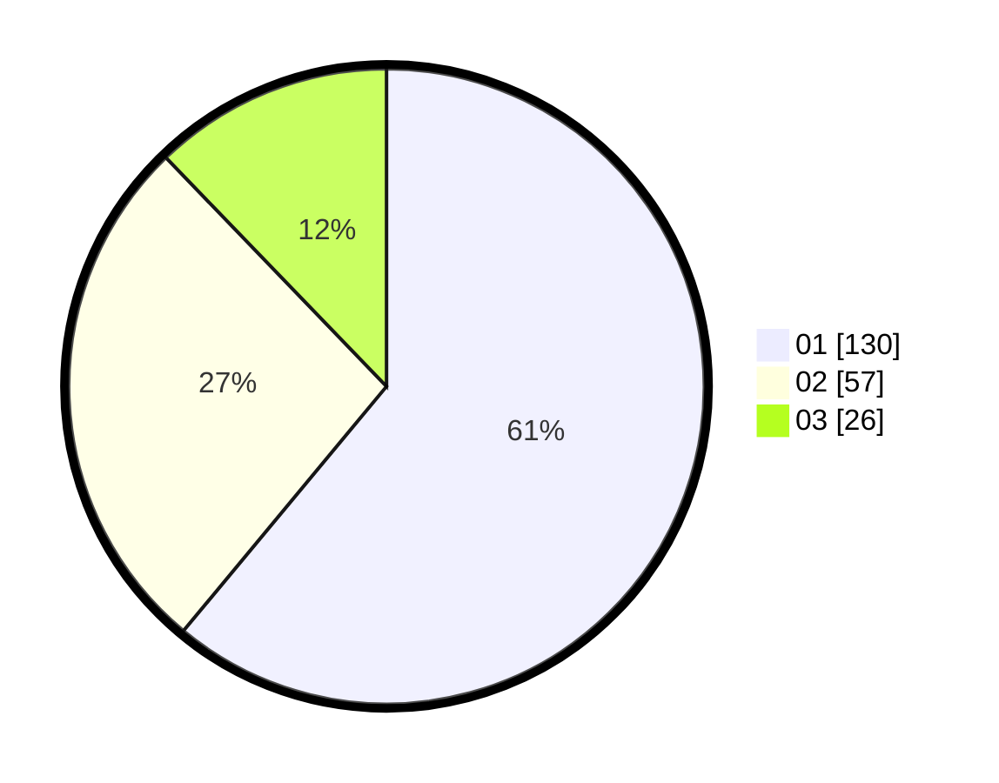

# Hasil

Hasil perolehan suara paslon dapat dilihat pada file paslon-01.txt, paslon-02.txt, dan paslon-03.txt.

Jika tidak ada, artinya data tersebut belum ada pada SIREKAP.

## Perolehan Suara

 * Paslon 01: **130**.
 * Paslon 02: **57**.
 * Paslon 03: **26**.

## Foto C Plano

https://sirekap-obj-formc.kpu.go.id/77d6/pemilu/ppwp/31/74/01/10/04/3174011004079-20240214-221524--a1097806-b50c-48a4-b986-8109a5256f1c.jpg

https://sirekap-obj-formc.kpu.go.id/77d6/pemilu/ppwp/31/74/01/10/04/3174011004079-20240214-194556--37bf8261-a7bc-4c2c-80db-489619863459.jpg

https://sirekap-obj-formc.kpu.go.id/77d6/pemilu/ppwp/31/74/01/10/04/3174011004079-20240214-221636--c0125a4e-39ee-4f65-974b-f789bbeafdf6.jpg

## DATA PEMILIH TETAP

Jumlah pemilih dalam DPT: **275**.
 * L: **130**.
 * P: **145**.

## DATA PENGGUNA HAK PILIH

Jumlah pengguna hak pilih dalam DPT: **210**.
 * L: **94**.
 * P: **116**.

Jumlah pengguna hak pilih dalam DPTb: **0**.
 * L: **0**.
 * P: **0**.

Jumlah pengguna hak pilih dalam DPK: **4**.
 * L: **2**.
 * P: **2**.

Jumlah pengguna hak pilih: **214**.
 * L: **96**.
 * P: **118**.

## JUMLAH SUARA SAH DAN TIDAK SAH

JUMLAH SELURUH SUARA SAH: **213**.

JUMLAH SUARA TIDAK SAH: **1**.

JUMLAH SELURUH SUARA SAH DAN SUARA TIDAK SAH: **214**.
