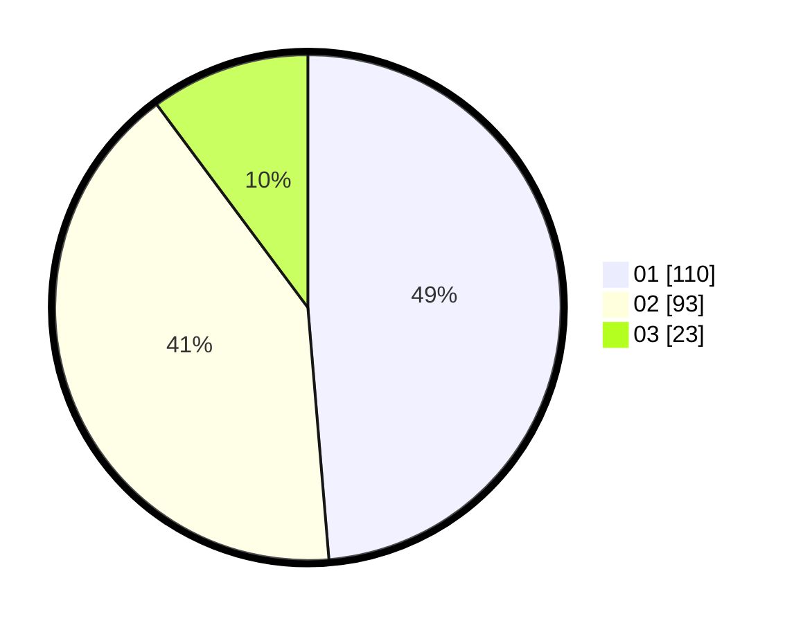

# Hasil

Hasil perolehan suara paslon dapat dilihat pada file paslon-01.txt, paslon-02.txt, dan paslon-03.txt.

Jika tidak ada, artinya data tersebut belum ada pada SIREKAP.

## Perolehan Suara

 * Paslon 01: **110**.
 * Paslon 02: **93**.
 * Paslon 03: **23**.

## Foto C Plano

https://sirekap-obj-formc.kpu.go.id/8a15/pemilu/ppwp/31/74/01/10/04/3174011004089-20240216-210648--b8f1f7c0-cc7a-4f18-8bc0-26efb5164bd6.jpg

https://sirekap-obj-formc.kpu.go.id/8a15/pemilu/ppwp/31/74/01/10/04/3174011004089-20240216-210649--ad5f7ab4-15a7-4714-8ac1-ec5471c4a69d.jpg

https://sirekap-obj-formc.kpu.go.id/8a15/pemilu/ppwp/31/74/01/10/04/3174011004089-20240216-210648--7dad7f63-96de-49d4-a510-1e4abeba0cbf.jpg

## DATA PEMILIH TETAP

Jumlah pemilih dalam DPT: **279**.
 * L: **145**.
 * P: **134**.

## DATA PENGGUNA HAK PILIH

Jumlah pengguna hak pilih dalam DPT: **230**.
 * L: **114**.
 * P: **116**.

Jumlah pengguna hak pilih dalam DPTb: **0**.
 * L: **0**.
 * P: **0**.

Jumlah pengguna hak pilih dalam DPK: **2**.
 * L: **0**.
 * P: **2**.

Jumlah pengguna hak pilih: **232**.
 * L: **114**.
 * P: **118**.

## JUMLAH SUARA SAH DAN TIDAK SAH

JUMLAH SELURUH SUARA SAH: **226**.

JUMLAH SUARA TIDAK SAH: **6**.

JUMLAH SELURUH SUARA SAH DAN SUARA TIDAK SAH: **232**.
