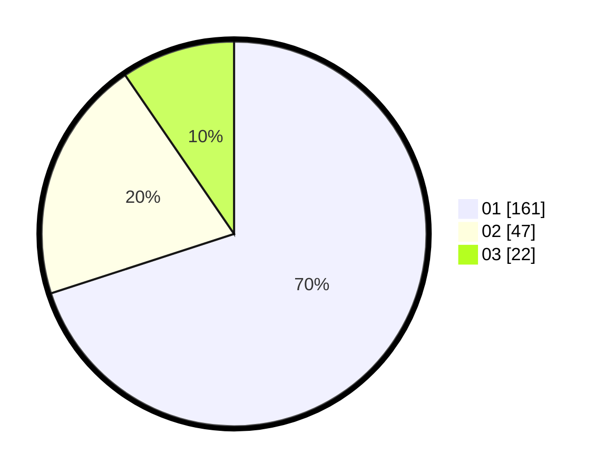

# Hasil

Hasil perolehan suara paslon dapat dilihat pada file paslon-01.txt, paslon-02.txt, dan paslon-03.txt.

Jika tidak ada, artinya data tersebut belum ada pada SIREKAP.

## Perolehan Suara

 * Paslon 01: **161**.
 * Paslon 02: **47**.
 * Paslon 03: **22**.

## Foto C Plano

https://sirekap-obj-formc.kpu.go.id/488b/pemilu/ppwp/31/74/01/10/04/3174011004090-20240214-212107--10cab712-6fbb-4ae8-ac4a-c35c4303cd93.jpg

https://sirekap-obj-formc.kpu.go.id/488b/pemilu/ppwp/31/74/01/10/04/3174011004090-20240214-155219--1b3431ca-6fbf-4037-a162-9dda7af9ab2a.jpg

https://sirekap-obj-formc.kpu.go.id/488b/pemilu/ppwp/31/74/01/10/04/3174011004090-20240214-212431--6f081699-2e34-4d52-8099-30c0ada74a3e.jpg
