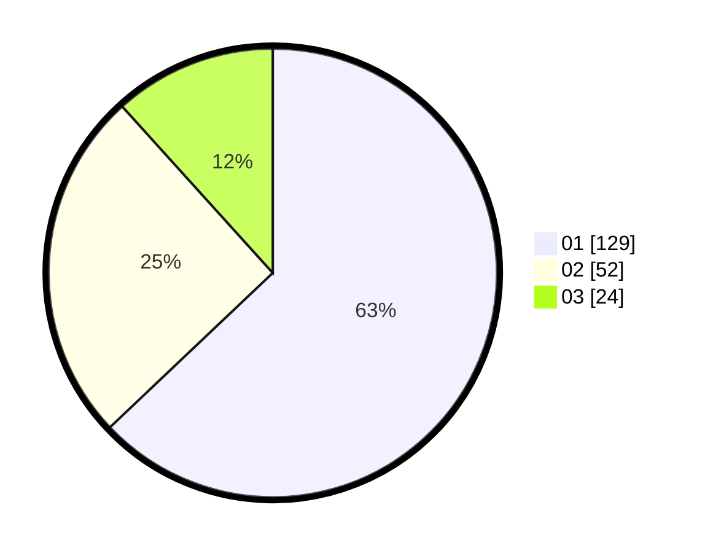

# Hasil

Hasil perolehan suara paslon dapat dilihat pada file paslon-01.txt, paslon-02.txt, dan paslon-03.txt.

Jika tidak ada, artinya data tersebut belum ada pada SIREKAP.

## Perolehan Suara

 * Paslon 01: **129**.
 * Paslon 02: **52**.
 * Paslon 03: **24**.

## Foto C Plano

https://sirekap-obj-formc.kpu.go.id/e009/pemilu/ppwp/31/74/01/10/04/3174011004095-20240214-155224--5fb0de22-09b6-4bbe-8e61-16ee0679b3f5.jpg

https://sirekap-obj-formc.kpu.go.id/e009/pemilu/ppwp/31/74/01/10/04/3174011004095-20240214-155240--d10a57d7-7331-4389-8ffd-ad8fc28b4b24.jpg

https://sirekap-obj-formc.kpu.go.id/e009/pemilu/ppwp/31/74/01/10/04/3174011004095-20240214-155255--b77a4fca-bed0-4d1d-a8de-d7609fdb0019.jpg

## DATA PEMILIH TETAP

Jumlah pemilih dalam DPT: **269**.
 * L: **138**.
 * P: **131**.

## DATA PENGGUNA HAK PILIH

Jumlah pengguna hak pilih dalam DPT: **205**.
 * L: **99**.
 * P: **106**.

Jumlah pengguna hak pilih dalam DPTb: **1**.
 * L: **0**.
 * P: **1**.

Jumlah pengguna hak pilih dalam DPK: **3**.
 * L: **2**.
 * P: **1**.

Jumlah pengguna hak pilih: **209**.
 * L: **101**.
 * P: **108**.

## JUMLAH SUARA SAH DAN TIDAK SAH

JUMLAH SELURUH SUARA SAH: **205**.

JUMLAH SUARA TIDAK SAH: **4**.

JUMLAH SELURUH SUARA SAH DAN SUARA TIDAK SAH: **209**.
