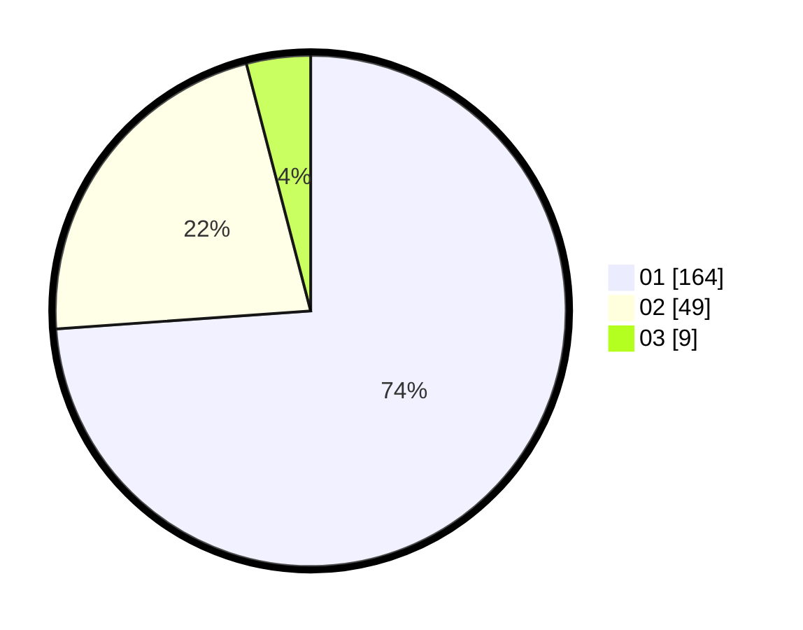

# Hasil

Hasil perolehan suara paslon dapat dilihat pada file paslon-01.txt, paslon-02.txt, dan paslon-03.txt.

Jika tidak ada, artinya data tersebut belum ada pada SIREKAP.

## Perolehan Suara

 * Paslon 01: **164**.
 * Paslon 02: **49**.
 * Paslon 03: **9**.

## Foto C Plano

https://sirekap-obj-formc.kpu.go.id/c371/pemilu/ppwp/31/74/01/10/04/3174011004096-20240214-184540--6c533c90-3f98-4554-921d-a2442b45b8a1.jpg

https://sirekap-obj-formc.kpu.go.id/c371/pemilu/ppwp/31/74/01/10/04/3174011004096-20240214-193117--88e5e8dd-f3fb-47ce-baa0-f0609c50f8b9.jpg

https://sirekap-obj-formc.kpu.go.id/c371/pemilu/ppwp/31/74/01/10/04/3174011004096-20240214-193155--0eb12913-4f8d-4859-b1c5-7ec92759668b.jpg

## DATA PEMILIH TETAP

Jumlah pemilih dalam DPT: **265**.
 * L: **127**.
 * P: **138**.

## DATA PENGGUNA HAK PILIH

Jumlah pengguna hak pilih dalam DPT: **221**.
 * L: **102**.
 * P: **119**.

Jumlah pengguna hak pilih dalam DPTb: **4**.
 * L: **1**.
 * P: **3**.

Jumlah pengguna hak pilih dalam DPK: **0**.
 * L: **0**.
 * P: **0**.

Jumlah pengguna hak pilih: **225**.
 * L: **103**.
 * P: **122**.

## JUMLAH SUARA SAH DAN TIDAK SAH

JUMLAH SELURUH SUARA SAH: **222**.

JUMLAH SUARA TIDAK SAH: **3**.

JUMLAH SELURUH SUARA SAH DAN SUARA TIDAK SAH: **225**.
