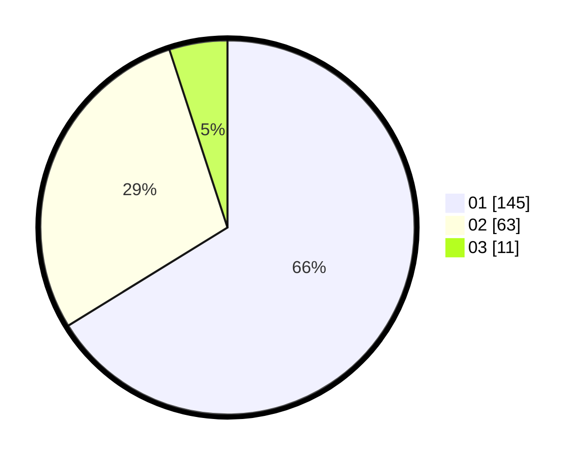

# Hasil

Hasil perolehan suara paslon dapat dilihat pada file paslon-01.txt, paslon-02.txt, dan paslon-03.txt.

Jika tidak ada, artinya data tersebut belum ada pada SIREKAP.

## Perolehan Suara

 * Paslon 01: **145**.
 * Paslon 02: **63**.
 * Paslon 03: **11**.

## Foto C Plano

https://sirekap-obj-formc.kpu.go.id/47d8/pemilu/ppwp/31/74/01/10/04/3174011004098-20240214-202920--f13e8148-8872-4ccf-a425-11ae7c78c661.jpg

https://sirekap-obj-formc.kpu.go.id/47d8/pemilu/ppwp/31/74/01/10/04/3174011004098-20240214-202958--81d48647-a815-4685-9e50-8ce5939787d9.jpg

https://sirekap-obj-formc.kpu.go.id/47d8/pemilu/ppwp/31/74/01/10/04/3174011004098-20240214-202646--3840de6b-b6cc-4818-80cc-530a9f7ebb7d.jpg

## DATA PEMILIH TETAP

Jumlah pemilih dalam DPT: **246**.
 * L: **137**.
 * P: **109**.

## DATA PENGGUNA HAK PILIH

Jumlah pengguna hak pilih dalam DPT: **221**.
 * L: **120**.
 * P: **101**.

Jumlah pengguna hak pilih dalam DPTb: **0**.
 * L: **0**.
 * P: **0**.

Jumlah pengguna hak pilih dalam DPK: **1**.
 * L: **1**.
 * P: **0**.

Jumlah pengguna hak pilih: **222**.
 * L: **121**.
 * P: **101**.

## JUMLAH SUARA SAH DAN TIDAK SAH

JUMLAH SELURUH SUARA SAH: **219**.

JUMLAH SUARA TIDAK SAH: **3**.

JUMLAH SELURUH SUARA SAH DAN SUARA TIDAK SAH: **222**.
