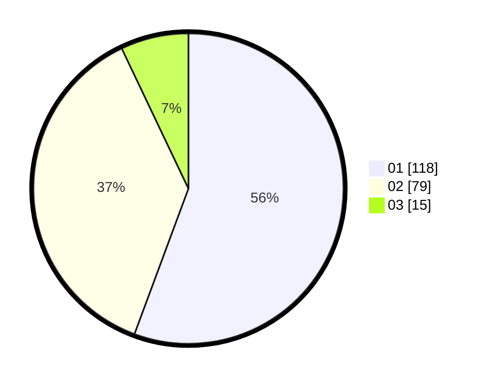

# Hasil

Hasil perolehan suara paslon dapat dilihat pada file paslon-01.txt, paslon-02.txt, dan paslon-03.txt.

Jika tidak ada, artinya data tersebut belum ada pada SIREKAP.

## Perolehan Suara

 * Paslon 01: **118**.
 * Paslon 02: **79**.
 * Paslon 03: **15**.

## Foto C Plano

https://sirekap-obj-formc.kpu.go.id/f0a7/pemilu/ppwp/31/74/01/10/04/3174011004099-20240214-211105--bd715367-c371-4d2b-8fe5-67afa975986a.jpg

https://sirekap-obj-formc.kpu.go.id/f0a7/pemilu/ppwp/31/74/01/10/04/3174011004099-20240214-211352--742aacb1-1dc9-4fb4-b9fb-a265b64beff9.jpg

https://sirekap-obj-formc.kpu.go.id/f0a7/pemilu/ppwp/31/74/01/10/04/3174011004099-20240214-211606--c2eee110-682c-472e-9d9c-f5759d5d68cb.jpg

## DATA PEMILIH TETAP

Jumlah pemilih dalam DPT: **265**.
 * L: **138**.
 * P: **127**.

## DATA PENGGUNA HAK PILIH

Jumlah pengguna hak pilih dalam DPT: **210**.
 * L: **106**.
 * P: **104**.

Jumlah pengguna hak pilih dalam DPTb: **2**.
 * L: **0**.
 * P: **2**.

Jumlah pengguna hak pilih dalam DPK: **1**.
 * L: **0**.
 * P: **1**.

Jumlah pengguna hak pilih: **213**.
 * L: **106**.
 * P: **107**.

## JUMLAH SUARA SAH DAN TIDAK SAH

JUMLAH SELURUH SUARA SAH: **212**.

JUMLAH SUARA TIDAK SAH: **1**.

JUMLAH SELURUH SUARA SAH DAN SUARA TIDAK SAH: **213**.
