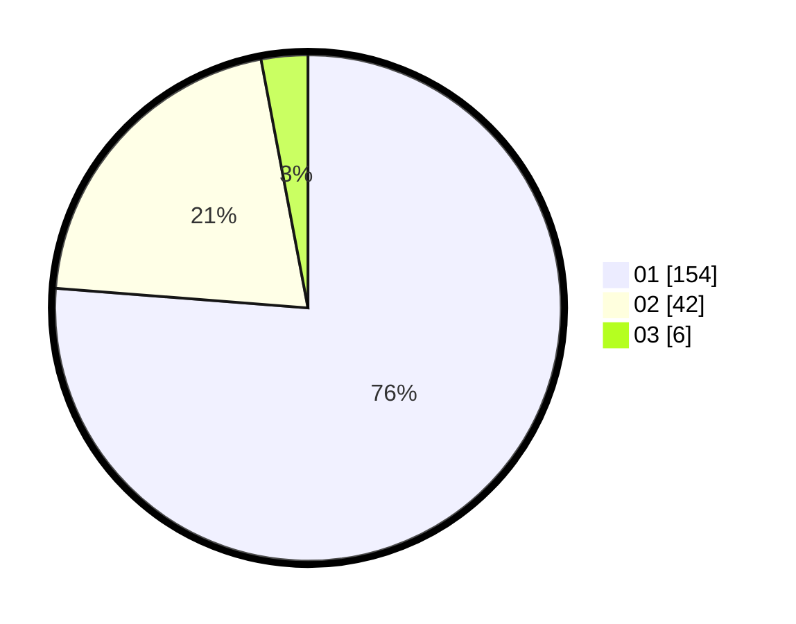

# Hasil

Hasil perolehan suara paslon dapat dilihat pada file paslon-01.txt, paslon-02.txt, dan paslon-03.txt.

Jika tidak ada, artinya data tersebut belum ada pada SIREKAP.

## Perolehan Suara

 * Paslon 01: **154**.
 * Paslon 02: **42**.
 * Paslon 03: **6**.

## Foto C Plano

https://sirekap-obj-formc.kpu.go.id/4f1c/pemilu/ppwp/31/74/01/10/04/3174011004104-20240214-155350--ff0d8690-bb43-4e3a-9ea2-b599486db494.jpg

https://sirekap-obj-formc.kpu.go.id/4f1c/pemilu/ppwp/31/74/01/10/04/3174011004104-20240214-141905--8eeac9ef-1d16-4e6e-ba6d-afaa28f529b4.jpg

https://sirekap-obj-formc.kpu.go.id/4f1c/pemilu/ppwp/31/74/01/10/04/3174011004104-20240214-155724--cf5afa75-c599-46c5-b946-bb1998b5f611.jpg

## DATA PEMILIH TETAP

Jumlah pemilih dalam DPT: **254**.
 * L: **130**.
 * P: **124**.

## DATA PENGGUNA HAK PILIH

Jumlah pengguna hak pilih dalam DPT: **207**.
 * L: **100**.
 * P: **107**.

Jumlah pengguna hak pilih dalam DPTb: **0**.
 * L: **0**.
 * P: **0**.

Jumlah pengguna hak pilih dalam DPK: **0**.
 * L: **0**.
 * P: **0**.

Jumlah pengguna hak pilih: **207**.
 * L: **100**.
 * P: **107**.

## JUMLAH SUARA SAH DAN TIDAK SAH

JUMLAH SELURUH SUARA SAH: **202**.

JUMLAH SUARA TIDAK SAH: **5**.

JUMLAH SELURUH SUARA SAH DAN SUARA TIDAK SAH: **207**.
