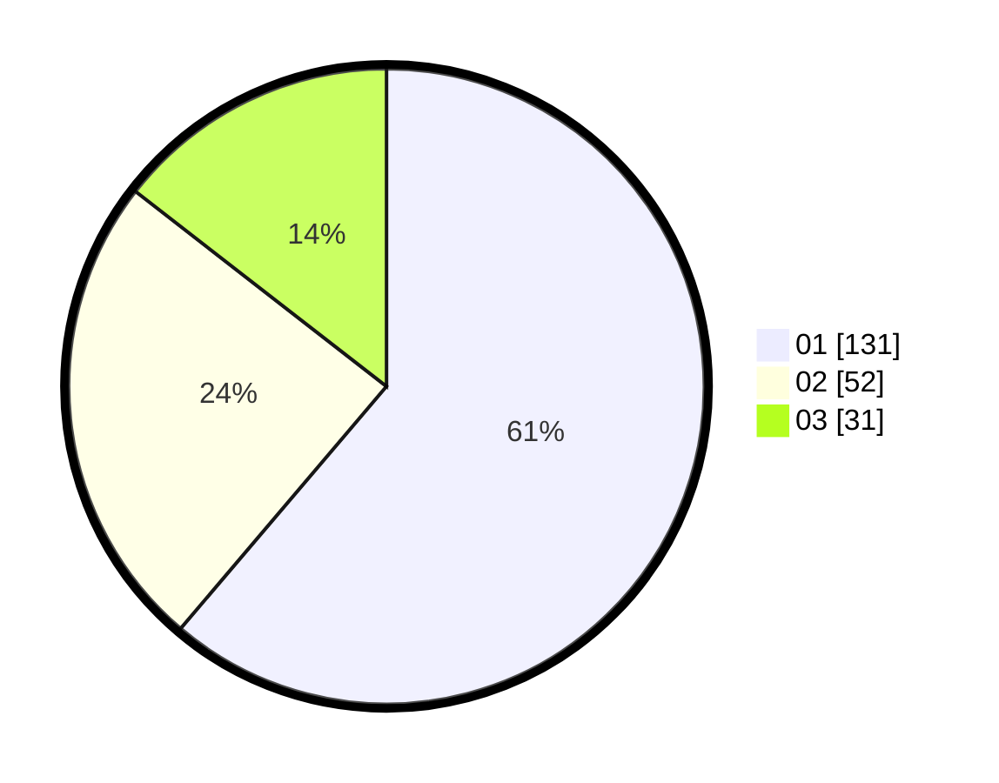

# Hasil

Hasil perolehan suara paslon dapat dilihat pada file paslon-01.txt, paslon-02.txt, dan paslon-03.txt.

Jika tidak ada, artinya data tersebut belum ada pada SIREKAP.

## Perolehan Suara

 * Paslon 01: **131**.
 * Paslon 02: **52**.
 * Paslon 03: **31**.

## Foto C Plano

https://sirekap-obj-formc.kpu.go.id/54a4/pemilu/ppwp/31/74/01/10/04/3174011004105-20240214-190351--01beb2b4-4a93-43a2-b01d-00942d8e0cb2.jpg

https://sirekap-obj-formc.kpu.go.id/54a4/pemilu/ppwp/31/74/01/10/04/3174011004105-20240214-190353--fe93bf42-79d0-4354-aa79-4db9bfd04ab3.jpg

https://sirekap-obj-formc.kpu.go.id/54a4/pemilu/ppwp/31/74/01/10/04/3174011004105-20240214-190357--1ff29ee7-0c23-4f44-babc-a0c2452e1509.jpg

## DATA PEMILIH TETAP

Jumlah pemilih dalam DPT: **262**.
 * L: **135**.
 * P: **127**.

## DATA PENGGUNA HAK PILIH

Jumlah pengguna hak pilih dalam DPT: **213**.
 * L: **107**.
 * P: **106**.

Jumlah pengguna hak pilih dalam DPTb: **2**.
 * L: **2**.
 * P: **0**.

Jumlah pengguna hak pilih dalam DPK: **2**.
 * L: **1**.
 * P: **1**.

Jumlah pengguna hak pilih: **217**.
 * L: **110**.
 * P: **107**.

## JUMLAH SUARA SAH DAN TIDAK SAH

JUMLAH SELURUH SUARA SAH: **214**.

JUMLAH SUARA TIDAK SAH: **3**.

JUMLAH SELURUH SUARA SAH DAN SUARA TIDAK SAH: **217**.
