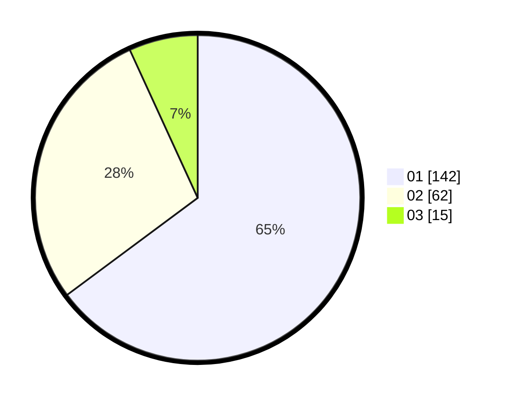

# Hasil

Hasil perolehan suara paslon dapat dilihat pada file paslon-01.txt, paslon-02.txt, dan paslon-03.txt.

Jika tidak ada, artinya data tersebut belum ada pada SIREKAP.

## Perolehan Suara

 * Paslon 01: **142**.
 * Paslon 02: **62**.
 * Paslon 03: **15**.

## Foto C Plano

https://sirekap-obj-formc.kpu.go.id/f9b4/pemilu/ppwp/31/74/01/10/04/3174011004108-20240214-184853--60a0205e-e48f-4326-8051-acd0561c6c95.jpg

https://sirekap-obj-formc.kpu.go.id/f9b4/pemilu/ppwp/31/74/01/10/04/3174011004108-20240214-155747--7415f1eb-d4ec-43ce-acea-893388921ee5.jpg

https://sirekap-obj-formc.kpu.go.id/f9b4/pemilu/ppwp/31/74/01/10/04/3174011004108-20240214-155216--71e199c1-0a2f-4483-9cfa-08dbddf12e2e.jpg

## DATA PEMILIH TETAP

Jumlah pemilih dalam DPT: **264**.
 * L: **135**.
 * P: **129**.

## DATA PENGGUNA HAK PILIH

Jumlah pengguna hak pilih dalam DPT: **218**.
 * L: **113**.
 * P: **105**.

Jumlah pengguna hak pilih dalam DPTb: **0**.
 * L: **0**.
 * P: **0**.

Jumlah pengguna hak pilih dalam DPK: **3**.
 * L: **1**.
 * P: **2**.

Jumlah pengguna hak pilih: **221**.
 * L: **114**.
 * P: **107**.

## JUMLAH SUARA SAH DAN TIDAK SAH

JUMLAH SELURUH SUARA SAH: **219**.

JUMLAH SUARA TIDAK SAH: **2**.

JUMLAH SELURUH SUARA SAH DAN SUARA TIDAK SAH: **221**.
