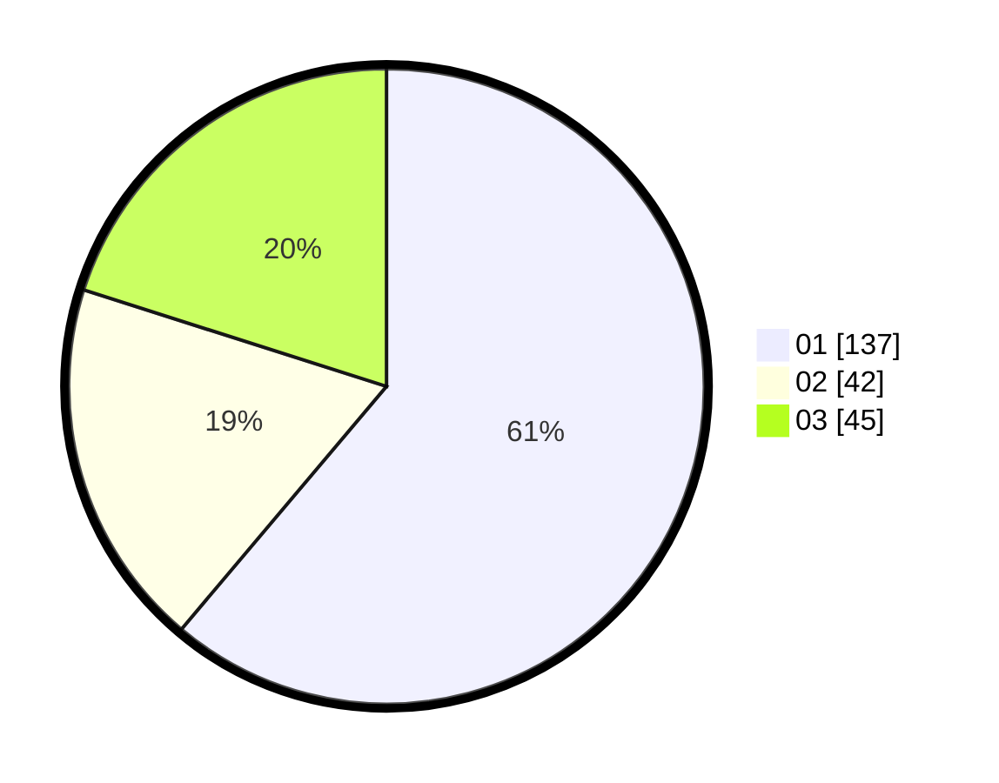

# Hasil

Hasil perolehan suara paslon dapat dilihat pada file paslon-01.txt, paslon-02.txt, dan paslon-03.txt.

Jika tidak ada, artinya data tersebut belum ada pada SIREKAP.

## Perolehan Suara

 * Paslon 01: **137**.
 * Paslon 02: **42**.
 * Paslon 03: **45**.

## Foto C Plano

https://sirekap-obj-formc.kpu.go.id/9dd0/pemilu/ppwp/31/74/01/10/04/3174011004116-20240214-155439--4358ca5f-7d49-4edc-9a7d-92bb46e37d44.jpg

https://sirekap-obj-formc.kpu.go.id/9dd0/pemilu/ppwp/31/74/01/10/04/3174011004116-20240214-155249--39936426-c52c-424a-835e-e973b2618829.jpg

https://sirekap-obj-formc.kpu.go.id/9dd0/pemilu/ppwp/31/74/01/10/04/3174011004116-20240214-155349--9076073d-2809-49d4-ae71-aab1c343dce9.jpg

## DATA PEMILIH TETAP

Jumlah pemilih dalam DPT: **251**.
 * L: **114**.
 * P: **137**.

## DATA PENGGUNA HAK PILIH

Jumlah pengguna hak pilih dalam DPT: **205**.
 * L: **88**.
 * P: **117**.

Jumlah pengguna hak pilih dalam DPTb: **14**.
 * L: **2**.
 * P: **12**.

Jumlah pengguna hak pilih dalam DPK: **5**.
 * L: **1**.
 * P: **4**.

Jumlah pengguna hak pilih: **224**.
 * L: **91**.
 * P: **133**.

## JUMLAH SUARA SAH DAN TIDAK SAH

JUMLAH SELURUH SUARA SAH: **224**.

JUMLAH SUARA TIDAK SAH: **1**.

JUMLAH SELURUH SUARA SAH DAN SUARA TIDAK SAH: **225**.
