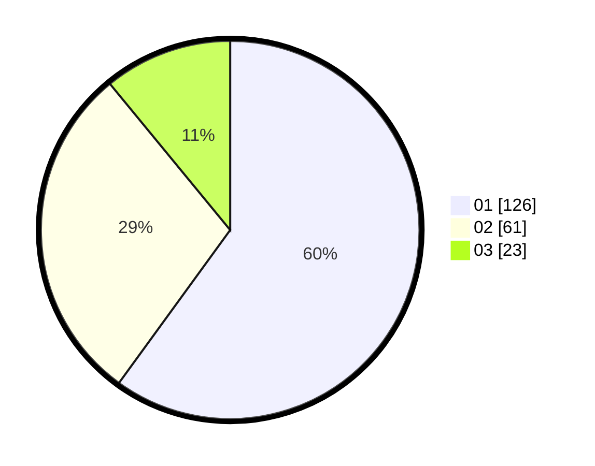

# Hasil

Hasil perolehan suara paslon dapat dilihat pada file paslon-01.txt, paslon-02.txt, dan paslon-03.txt.

Jika tidak ada, artinya data tersebut belum ada pada SIREKAP.

## Perolehan Suara

 * Paslon 01: **126**.
 * Paslon 02: **61**.
 * Paslon 03: **23**.

## Foto C Plano

https://sirekap-obj-formc.kpu.go.id/d189/pemilu/ppwp/31/74/01/10/05/3174011005001-20240216-145942--0b907d6c-bac4-4153-a4d9-067073f28128.jpg

https://sirekap-obj-formc.kpu.go.id/d189/pemilu/ppwp/31/74/01/10/05/3174011005001-20240216-152138--b5c02715-9bb1-432a-91c9-2e8541a67061.jpg

https://sirekap-obj-formc.kpu.go.id/d189/pemilu/ppwp/31/74/01/10/05/3174011005001-20240216-150815--670ff5f7-817b-4b7f-86fb-cbd3aa4424f1.jpg

## DATA PEMILIH TETAP

Jumlah pemilih dalam DPT: **263**.
 * L: **132**.
 * P: **131**.

## DATA PENGGUNA HAK PILIH

Jumlah pengguna hak pilih dalam DPT: **214**.
 * L: **103**.
 * P: **111**.

Jumlah pengguna hak pilih dalam DPTb: **2**.
 * L: **0**.
 * P: **2**.

Jumlah pengguna hak pilih dalam DPK: **0**.
 * L: **0**.
 * P: **0**.

Jumlah pengguna hak pilih: **216**.
 * L: **103**.
 * P: **113**.

## JUMLAH SUARA SAH DAN TIDAK SAH

JUMLAH SELURUH SUARA SAH: **210**.

JUMLAH SUARA TIDAK SAH: **6**.

JUMLAH SELURUH SUARA SAH DAN SUARA TIDAK SAH: **216**.
