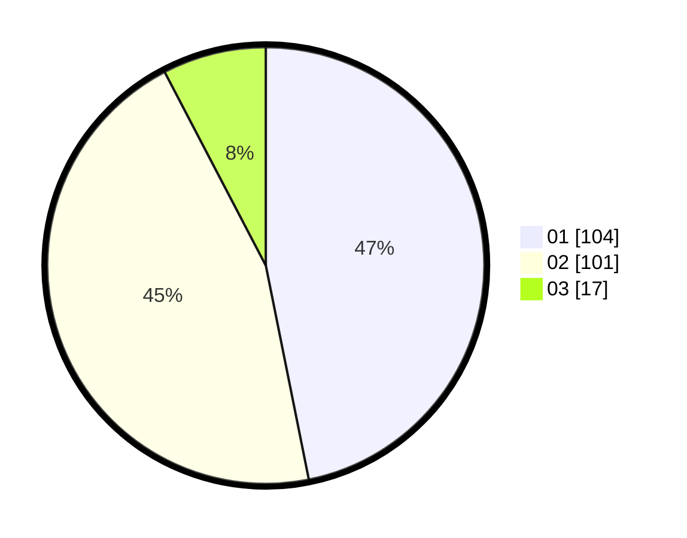

# Hasil

Hasil perolehan suara paslon dapat dilihat pada file paslon-01.txt, paslon-02.txt, dan paslon-03.txt.

Jika tidak ada, artinya data tersebut belum ada pada SIREKAP.

## Perolehan Suara

 * Paslon 01: **104**.
 * Paslon 02: **101**.
 * Paslon 03: **17**.

## Foto C Plano

https://sirekap-obj-formc.kpu.go.id/ff7f/pemilu/ppwp/31/74/01/10/05/3174011005005-20240216-231112--0bed3e4c-313b-437d-8b5a-db252a6bcc96.jpg

https://sirekap-obj-formc.kpu.go.id/ff7f/pemilu/ppwp/31/74/01/10/05/3174011005005-20240216-231114--dfe967db-12df-4c13-8e7a-148622182b96.jpg

https://sirekap-obj-formc.kpu.go.id/ff7f/pemilu/ppwp/31/74/01/10/05/3174011005005-20240216-231113--dbf6743f-9370-425b-832c-79a9c759ba47.jpg

## DATA PEMILIH TETAP

Jumlah pemilih dalam DPT: **272**.
 * L: **134**.
 * P: **138**.

## DATA PENGGUNA HAK PILIH

Jumlah pengguna hak pilih dalam DPT: **225**.
 * L: **111**.
 * P: **114**.

Jumlah pengguna hak pilih dalam DPTb: **0**.
 * L: **0**.
 * P: **0**.

Jumlah pengguna hak pilih dalam DPK: **0**.
 * L: **0**.
 * P: **0**.

Jumlah pengguna hak pilih: **225**.
 * L: **111**.
 * P: **114**.

## JUMLAH SUARA SAH DAN TIDAK SAH

JUMLAH SELURUH SUARA SAH: **222**.

JUMLAH SUARA TIDAK SAH: **3**.

JUMLAH SELURUH SUARA SAH DAN SUARA TIDAK SAH: **225**.
