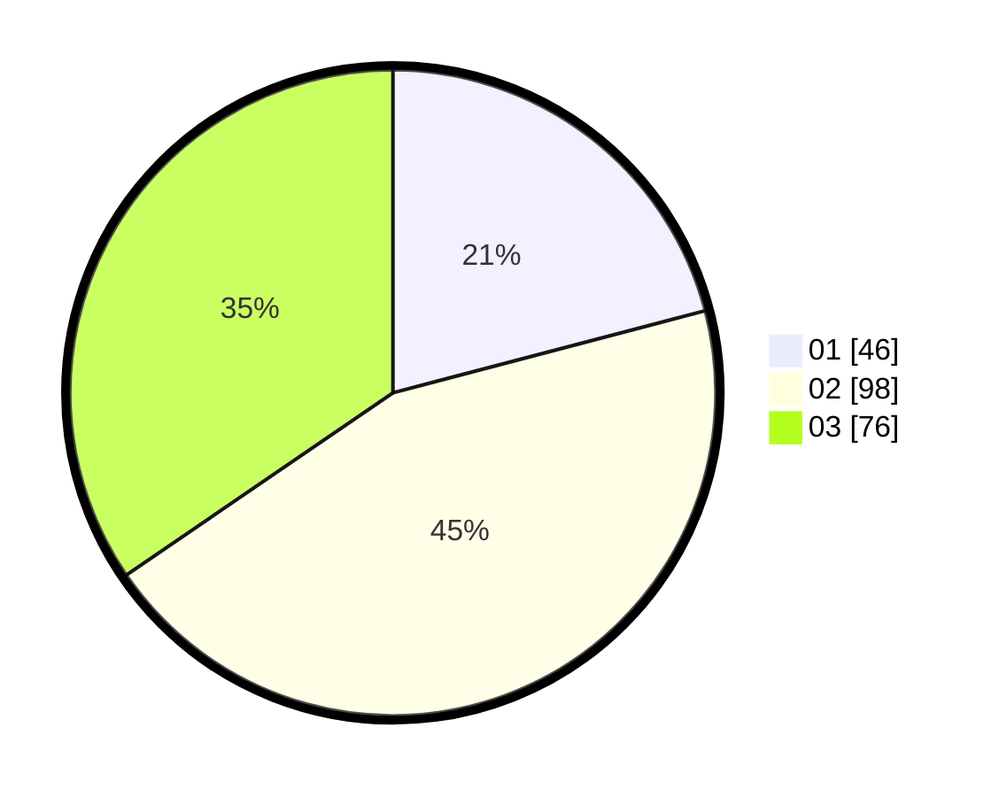

# Hasil

Hasil perolehan suara paslon dapat dilihat pada file paslon-01.txt, paslon-02.txt, dan paslon-03.txt.

Jika tidak ada, artinya data tersebut belum ada pada SIREKAP.

## Perolehan Suara

 * Paslon 01: **46**.
 * Paslon 02: **98**.
 * Paslon 03: **76**.

## Foto C Plano

https://sirekap-obj-formc.kpu.go.id/00ba/pemilu/ppwp/31/74/01/10/05/3174011005007-20240214-200643--ecc24c81-5d43-4118-be34-e1a9b0d1fb89.jpg

https://sirekap-obj-formc.kpu.go.id/00ba/pemilu/ppwp/31/74/01/10/05/3174011005007-20240214-201542--ac25501d-4dcb-472d-80f8-b566a07b6622.jpg

https://sirekap-obj-formc.kpu.go.id/00ba/pemilu/ppwp/31/74/01/10/05/3174011005007-20240214-201557--97554894-a462-450e-85d2-68cff22edc0d.jpg

## DATA PEMILIH TETAP

Jumlah pemilih dalam DPT: **263**.
 * L: **115**.
 * P: **148**.

## DATA PENGGUNA HAK PILIH

Jumlah pengguna hak pilih dalam DPT: **213**.
 * L: **90**.
 * P: **123**.

Jumlah pengguna hak pilih dalam DPTb: **11**.
 * L: **6**.
 * P: **5**.

Jumlah pengguna hak pilih dalam DPK: **3**.
 * L: **1**.
 * P: **2**.

Jumlah pengguna hak pilih: **227**.
 * L: **97**.
 * P: **130**.

## JUMLAH SUARA SAH DAN TIDAK SAH

JUMLAH SELURUH SUARA SAH: **220**.

JUMLAH SUARA TIDAK SAH: **7**.

JUMLAH SELURUH SUARA SAH DAN SUARA TIDAK SAH: **227**.
