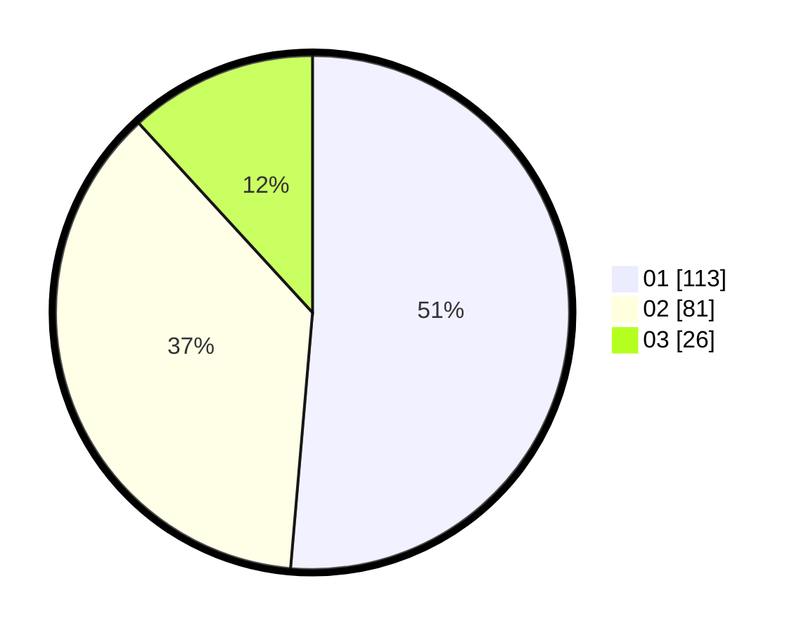

# Hasil

Hasil perolehan suara paslon dapat dilihat pada file paslon-01.txt, paslon-02.txt, dan paslon-03.txt.

Jika tidak ada, artinya data tersebut belum ada pada SIREKAP.

## Perolehan Suara

 * Paslon 01: **113**.
 * Paslon 02: **81**.
 * Paslon 03: **26**.

## Foto C Plano

https://sirekap-obj-formc.kpu.go.id/324f/pemilu/ppwp/31/74/01/10/05/3174011005012-20240216-182842--6312c9a3-543e-46da-a628-a57eac5a3f40.jpg

https://sirekap-obj-formc.kpu.go.id/324f/pemilu/ppwp/31/74/01/10/05/3174011005012-20240216-113707--3a9fa234-b31e-44a9-8031-98e3e56180f2.jpg

https://sirekap-obj-formc.kpu.go.id/324f/pemilu/ppwp/31/74/01/10/05/3174011005012-20240216-183441--e49384f4-0ea1-4e5b-a532-e9882e423d90.jpg

## DATA PEMILIH TETAP

Jumlah pemilih dalam DPT: **281**.
 * L: **140**.
 * P: **141**.

## DATA PENGGUNA HAK PILIH

Jumlah pengguna hak pilih dalam DPT: **218**.
 * L: **110**.
 * P: **108**.

Jumlah pengguna hak pilih dalam DPTb: **0**.
 * L: **0**.
 * P: **0**.

Jumlah pengguna hak pilih dalam DPK: **5**.
 * L: **3**.
 * P: **2**.

Jumlah pengguna hak pilih: **223**.
 * L: **113**.
 * P: **110**.

## JUMLAH SUARA SAH DAN TIDAK SAH

JUMLAH SELURUH SUARA SAH: **220**.

JUMLAH SUARA TIDAK SAH: **3**.

JUMLAH SELURUH SUARA SAH DAN SUARA TIDAK SAH: **223**.
