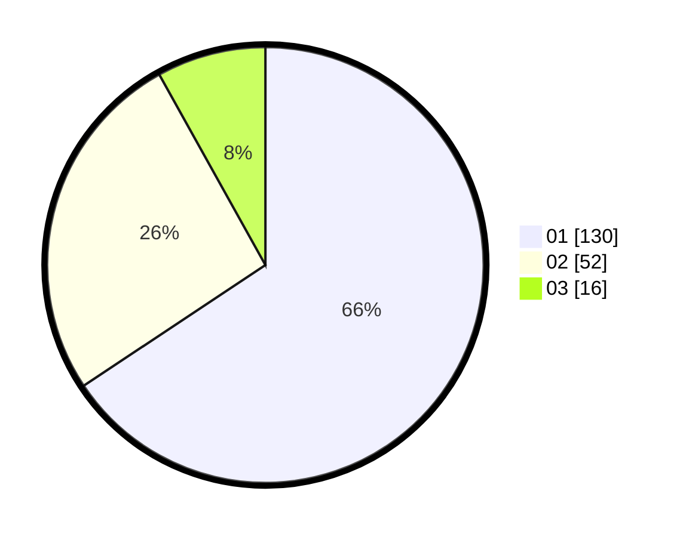

# Hasil

Hasil perolehan suara paslon dapat dilihat pada file paslon-01.txt, paslon-02.txt, dan paslon-03.txt.

Jika tidak ada, artinya data tersebut belum ada pada SIREKAP.

## Perolehan Suara

 * Paslon 01: **130**.
 * Paslon 02: **52**.
 * Paslon 03: **16**.

## Foto C Plano

https://sirekap-obj-formc.kpu.go.id/a0f3/pemilu/ppwp/31/74/01/10/05/3174011005016-20240214-224626--30e5374a-faae-4885-8f40-4bce911134bc.jpg

https://sirekap-obj-formc.kpu.go.id/a0f3/pemilu/ppwp/31/74/01/10/05/3174011005016-20240214-211831--67736f51-624c-4a98-9e3f-df8007e71f3b.jpg

https://sirekap-obj-formc.kpu.go.id/a0f3/pemilu/ppwp/31/74/01/10/05/3174011005016-20240214-211953--1ff9c007-d3ac-4cd3-9bef-311fbbd9fb85.jpg

## DATA PEMILIH TETAP

Jumlah pemilih dalam DPT: **200**.
 * L: **88**.
 * P: **112**.

## DATA PENGGUNA HAK PILIH

Jumlah pengguna hak pilih dalam DPT: **228**.
 * L: **104**.
 * P: **124**.

Jumlah pengguna hak pilih dalam DPTb: **0**.
 * L: **0**.
 * P: **0**.

Jumlah pengguna hak pilih dalam DPK: **229**.
 * L: **1**.
 * P: **0**.

Jumlah pengguna hak pilih: **229**.
 * L: **105**.
 * P: **124**.

## JUMLAH SUARA SAH DAN TIDAK SAH

JUMLAH SELURUH SUARA SAH: **198**.

JUMLAH SUARA TIDAK SAH: **2**.

JUMLAH SELURUH SUARA SAH DAN SUARA TIDAK SAH: **200**.
