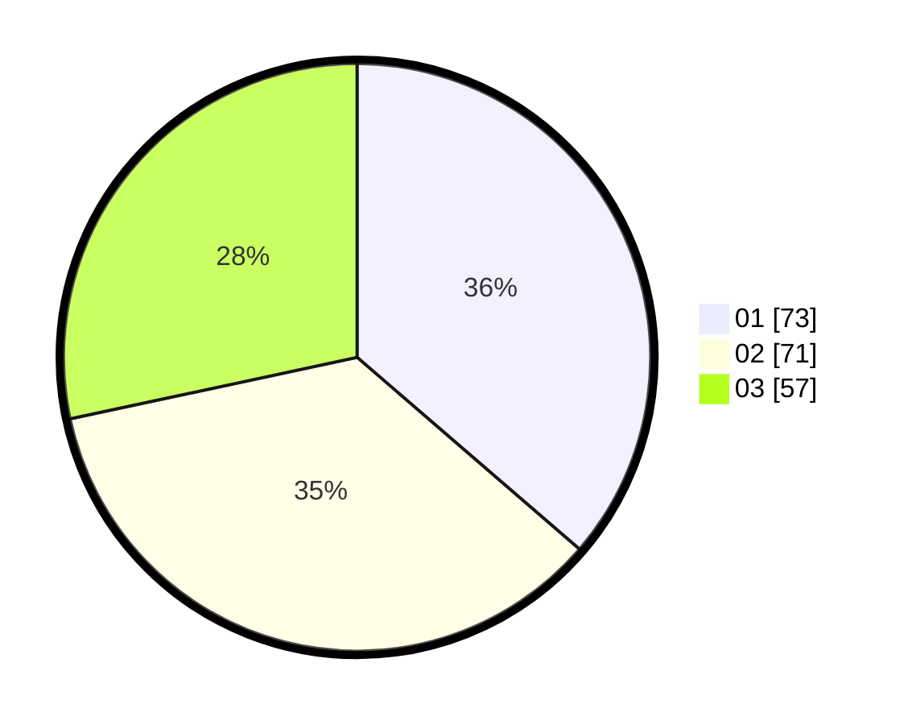

# Hasil

Hasil perolehan suara paslon dapat dilihat pada file paslon-01.txt, paslon-02.txt, dan paslon-03.txt.

Jika tidak ada, artinya data tersebut belum ada pada SIREKAP.

## Perolehan Suara

 * Paslon 01: **73**.
 * Paslon 02: **71**.
 * Paslon 03: **57**.

## Foto C Plano

https://sirekap-obj-formc.kpu.go.id/d09f/pemilu/ppwp/31/74/01/10/05/3174011005019-20240214-194526--9f3330d5-cdff-41c4-a8bb-d5dbb8ac2cd2.jpg

https://sirekap-obj-formc.kpu.go.id/d09f/pemilu/ppwp/31/74/01/10/05/3174011005019-20240214-194622--f3f4eeaf-282f-42f2-9849-97f944789a4a.jpg

https://sirekap-obj-formc.kpu.go.id/d09f/pemilu/ppwp/31/74/01/10/05/3174011005019-20240214-194756--d0645144-4380-4780-886b-e1edfac95dc1.jpg

## DATA PEMILIH TETAP

Jumlah pemilih dalam DPT: **194**.
 * L: **99**.
 * P: **95**.

## DATA PENGGUNA HAK PILIH

Jumlah pengguna hak pilih dalam DPT: **194**.
 * L: **99**.
 * P: **95**.

Jumlah pengguna hak pilih dalam DPTb: **3**.
 * L: **1**.
 * P: **2**.

Jumlah pengguna hak pilih dalam DPK: **4**.
 * L: **1**.
 * P: **3**.

Jumlah pengguna hak pilih: **201**.
 * L: **101**.
 * P: **100**.

## JUMLAH SUARA SAH DAN TIDAK SAH

JUMLAH SELURUH SUARA SAH: **201**.

JUMLAH SUARA TIDAK SAH: **3**.

JUMLAH SELURUH SUARA SAH DAN SUARA TIDAK SAH: **204**.
