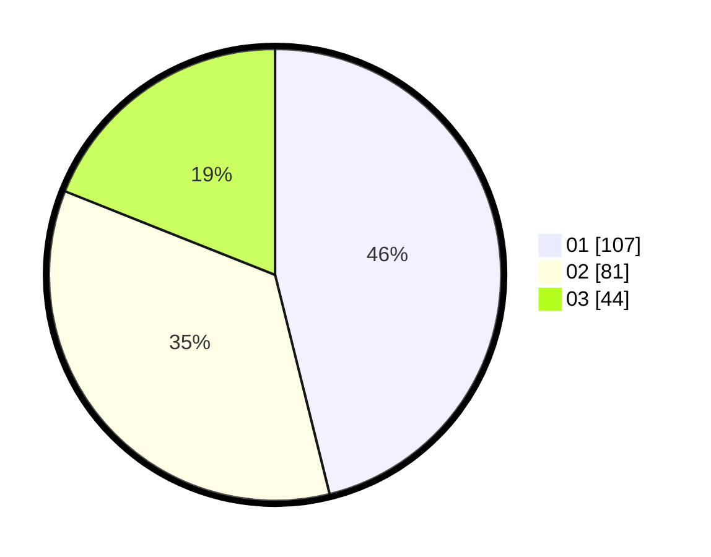

# Hasil

Hasil perolehan suara paslon dapat dilihat pada file paslon-01.txt, paslon-02.txt, dan paslon-03.txt.

Jika tidak ada, artinya data tersebut belum ada pada SIREKAP.

## Perolehan Suara

 * Paslon 01: **107**.
 * Paslon 02: **81**.
 * Paslon 03: **44**.

## Foto C Plano

https://sirekap-obj-formc.kpu.go.id/5a4d/pemilu/ppwp/31/74/01/10/05/3174011005023-20240214-203140--9d6377be-82dc-4e43-bad9-3613ef0a605b.jpg

https://sirekap-obj-formc.kpu.go.id/5a4d/pemilu/ppwp/31/74/01/10/05/3174011005023-20240214-194613--d23aaeb7-ae4e-46b9-a0a1-63969f46e01e.jpg

https://sirekap-obj-formc.kpu.go.id/5a4d/pemilu/ppwp/31/74/01/10/05/3174011005023-20240214-194816--c111e543-1123-4c31-b913-84471cba6e42.jpg

## DATA PEMILIH TETAP

Jumlah pemilih dalam DPT: **278**.
 * L: **135**.
 * P: **143**.

## DATA PENGGUNA HAK PILIH

Jumlah pengguna hak pilih dalam DPT: **226**.
 * L: **103**.
 * P: **123**.

Jumlah pengguna hak pilih dalam DPTb: **7**.
 * L: **2**.
 * P: **5**.

Jumlah pengguna hak pilih dalam DPK: **0**.
 * L: **0**.
 * P: **0**.

Jumlah pengguna hak pilih: **233**.
 * L: **105**.
 * P: **128**.

## JUMLAH SUARA SAH DAN TIDAK SAH

JUMLAH SELURUH SUARA SAH: **232**.

JUMLAH SUARA TIDAK SAH: **1**.

JUMLAH SELURUH SUARA SAH DAN SUARA TIDAK SAH: **233**.
