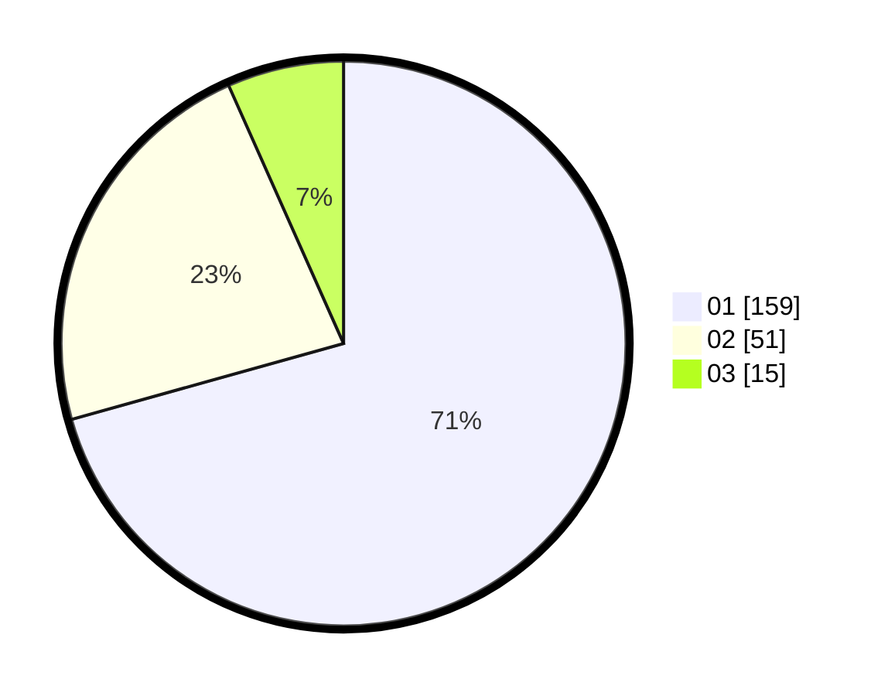

# Hasil

Hasil perolehan suara paslon dapat dilihat pada file paslon-01.txt, paslon-02.txt, dan paslon-03.txt.

Jika tidak ada, artinya data tersebut belum ada pada SIREKAP.

## Perolehan Suara

 * Paslon 01: **159**.
 * Paslon 02: **51**.
 * Paslon 03: **15**.

## Foto C Plano

https://sirekap-obj-formc.kpu.go.id/1ba4/pemilu/ppwp/31/74/01/10/05/3174011005029-20240214-211450--e2168fc2-17ba-40f6-9688-8ee28aba71d7.jpg

https://sirekap-obj-formc.kpu.go.id/1ba4/pemilu/ppwp/31/74/01/10/05/3174011005029-20240214-211519--c9c412b2-0e69-4f2c-8867-5566c08b72e9.jpg

https://sirekap-obj-formc.kpu.go.id/1ba4/pemilu/ppwp/31/74/01/10/05/3174011005029-20240214-211622--69348eff-79ac-4996-81eb-e8fdc77ae867.jpg

## DATA PEMILIH TETAP

Jumlah pemilih dalam DPT: **278**.
 * L: **131**.
 * P: **147**.

## DATA PENGGUNA HAK PILIH

Jumlah pengguna hak pilih dalam DPT: **224**.
 * L: **104**.
 * P: **120**.

Jumlah pengguna hak pilih dalam DPTb: **0**.
 * L: **0**.
 * P: **0**.

Jumlah pengguna hak pilih dalam DPK: **1**.
 * L: **0**.
 * P: **1**.

Jumlah pengguna hak pilih: **225**.
 * L: **0**.
 * P: **0**.

## JUMLAH SUARA SAH DAN TIDAK SAH

JUMLAH SELURUH SUARA SAH: **225**.

JUMLAH SUARA TIDAK SAH: **0**.

JUMLAH SELURUH SUARA SAH DAN SUARA TIDAK SAH: **225**.
