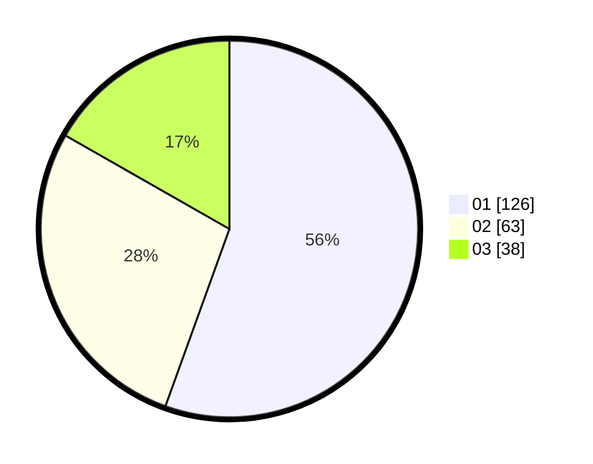

# Hasil

Hasil perolehan suara paslon dapat dilihat pada file paslon-01.txt, paslon-02.txt, dan paslon-03.txt.

Jika tidak ada, artinya data tersebut belum ada pada SIREKAP.

## Perolehan Suara

 * Paslon 01: **126**.
 * Paslon 02: **63**.
 * Paslon 03: **38**.

## Foto C Plano

https://sirekap-obj-formc.kpu.go.id/496e/pemilu/ppwp/31/74/01/10/05/3174011005037-20240214-155519--627002d5-42e6-400e-ad0b-32c842896fbf.jpg

https://sirekap-obj-formc.kpu.go.id/496e/pemilu/ppwp/31/74/01/10/05/3174011005037-20240214-155555--180abb82-f7e2-4dfd-af1e-b9cf37a69aa8.jpg

https://sirekap-obj-formc.kpu.go.id/496e/pemilu/ppwp/31/74/01/10/05/3174011005037-20240214-155640--6ba4d636-df62-4b84-bb54-b537a83886dc.jpg

## DATA PEMILIH TETAP

Jumlah pemilih dalam DPT: **261**.
 * L: **127**.
 * P: **134**.

## DATA PENGGUNA HAK PILIH

Jumlah pengguna hak pilih dalam DPT: **217**.
 * L: **103**.
 * P: **114**.

Jumlah pengguna hak pilih dalam DPTb: **10**.
 * L: **4**.
 * P: **6**.

Jumlah pengguna hak pilih dalam DPK: **2**.
 * L: **1**.
 * P: **1**.

Jumlah pengguna hak pilih: **229**.
 * L: **108**.
 * P: **121**.

## JUMLAH SUARA SAH DAN TIDAK SAH

JUMLAH SELURUH SUARA SAH: **227**.

JUMLAH SUARA TIDAK SAH: **2**.

JUMLAH SELURUH SUARA SAH DAN SUARA TIDAK SAH: **229**.
