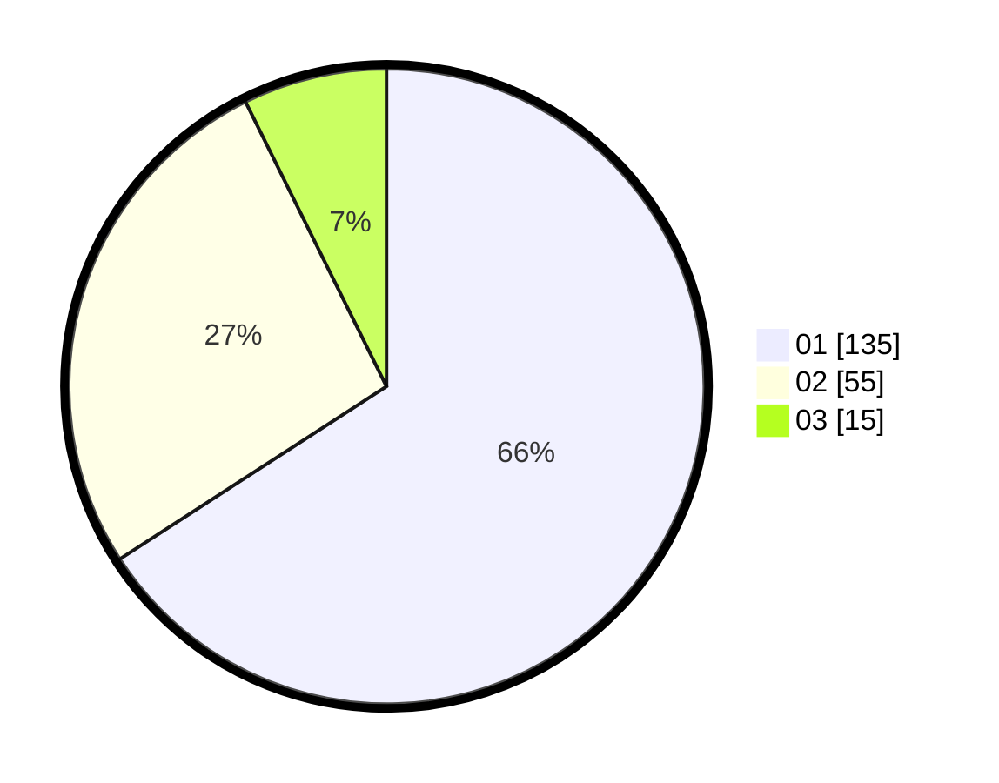

# Hasil

Hasil perolehan suara paslon dapat dilihat pada file paslon-01.txt, paslon-02.txt, dan paslon-03.txt.

Jika tidak ada, artinya data tersebut belum ada pada SIREKAP.

## Perolehan Suara

 * Paslon 01: **135**.
 * Paslon 02: **55**.
 * Paslon 03: **15**.

## Foto C Plano

https://sirekap-obj-formc.kpu.go.id/c9ad/pemilu/ppwp/31/74/01/10/05/3174011005040-20240214-155143--25bf7b26-a778-4789-bd8f-cdc85c6f72df.jpg

https://sirekap-obj-formc.kpu.go.id/c9ad/pemilu/ppwp/31/74/01/10/05/3174011005040-20240214-155754--916cbf44-38c6-48d9-97bb-f3833ae7b060.jpg

https://sirekap-obj-formc.kpu.go.id/c9ad/pemilu/ppwp/31/74/01/10/05/3174011005040-20240216-142239--a545b404-ff8a-4f14-8a14-6acf06ed5427.jpg

## DATA PEMILIH TETAP

Jumlah pemilih dalam DPT: **208**.
 * L: **108**.
 * P: **100**.

## DATA PENGGUNA HAK PILIH

Jumlah pengguna hak pilih dalam DPT: **200**.
 * L: **104**.
 * P: **96**.

Jumlah pengguna hak pilih dalam DPTb: **2**.
 * L: **0**.
 * P: **2**.

Jumlah pengguna hak pilih dalam DPK: **6**.
 * L: **4**.
 * P: **2**.

Jumlah pengguna hak pilih: **208**.
 * L: **108**.
 * P: **100**.

## JUMLAH SUARA SAH DAN TIDAK SAH

JUMLAH SELURUH SUARA SAH: **205**.

JUMLAH SUARA TIDAK SAH: **3**.

JUMLAH SELURUH SUARA SAH DAN SUARA TIDAK SAH: **208**.
