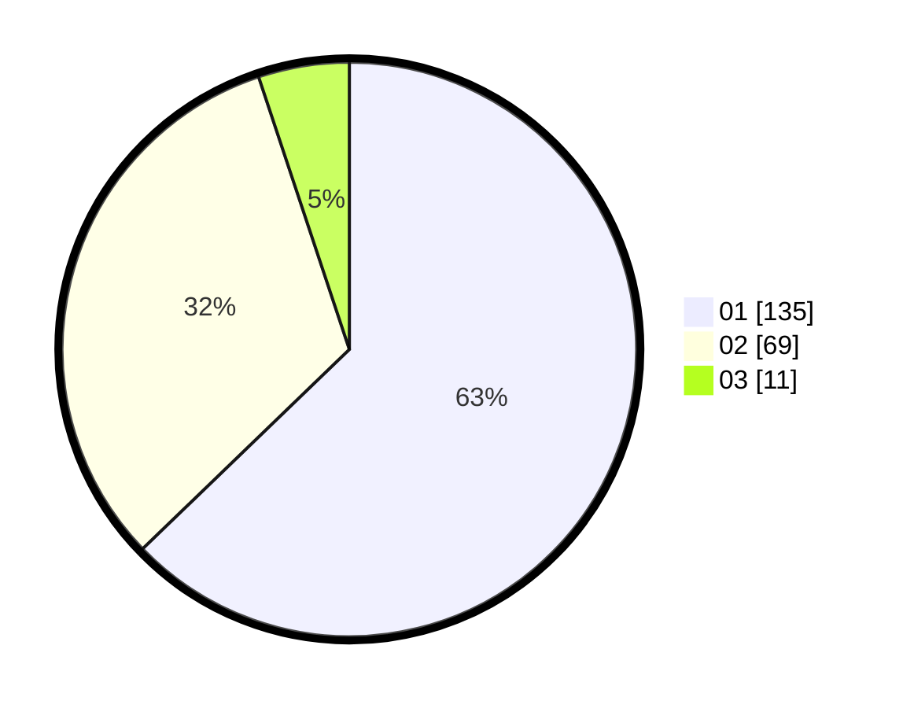

# Hasil

Hasil perolehan suara paslon dapat dilihat pada file paslon-01.txt, paslon-02.txt, dan paslon-03.txt.

Jika tidak ada, artinya data tersebut belum ada pada SIREKAP.

## Perolehan Suara

 * Paslon 01: **135**.
 * Paslon 02: **69**.
 * Paslon 03: **11**.

## Foto C Plano

https://sirekap-obj-formc.kpu.go.id/1638/pemilu/ppwp/31/74/01/10/05/3174011005041-20240215-182642--9add73bd-13df-47da-b506-90739e0d706e.jpg

https://sirekap-obj-formc.kpu.go.id/1638/pemilu/ppwp/31/74/01/10/05/3174011005041-20240215-183246--c2d26e7c-334d-4ae4-9cc3-d29e7172b1b0.jpg

https://sirekap-obj-formc.kpu.go.id/1638/pemilu/ppwp/31/74/01/10/05/3174011005041-20240215-183310--38770562-92c1-4c5e-a8c5-ace3eb74d422.jpg

## DATA PEMILIH TETAP

Jumlah pemilih dalam DPT: **260**.
 * L: **130**.
 * P: **130**.

## DATA PENGGUNA HAK PILIH

Jumlah pengguna hak pilih dalam DPT: **216**.
 * L: **113**.
 * P: **103**.

Jumlah pengguna hak pilih dalam DPTb: **5**.
 * L: **2**.
 * P: **3**.

Jumlah pengguna hak pilih dalam DPK: **1**.
 * L: **0**.
 * P: **1**.

Jumlah pengguna hak pilih: **222**.
 * L: **115**.
 * P: **107**.

## JUMLAH SUARA SAH DAN TIDAK SAH

JUMLAH SELURUH SUARA SAH: **215**.

JUMLAH SUARA TIDAK SAH: **7**.

JUMLAH SELURUH SUARA SAH DAN SUARA TIDAK SAH: **222**.
