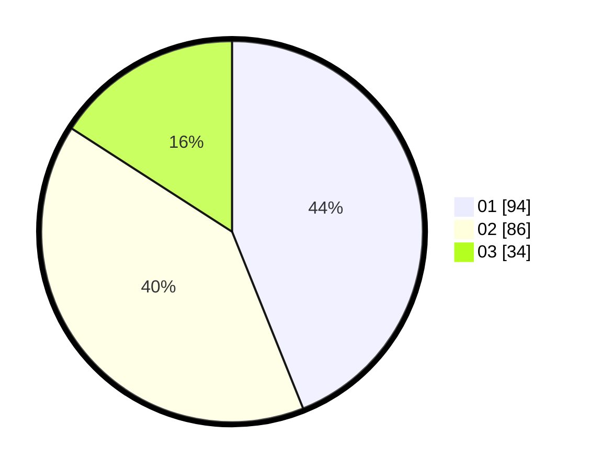

# Hasil

Hasil perolehan suara paslon dapat dilihat pada file paslon-01.txt, paslon-02.txt, dan paslon-03.txt.

Jika tidak ada, artinya data tersebut belum ada pada SIREKAP.

## Perolehan Suara

 * Paslon 01: **94**.
 * Paslon 02: **86**.
 * Paslon 03: **34**.

## Foto C Plano

https://sirekap-obj-formc.kpu.go.id/b5d7/pemilu/ppwp/31/74/01/10/05/3174011005042-20240214-200116--2a69a41f-4371-427d-9ee2-eea84da41869.jpg

https://sirekap-obj-formc.kpu.go.id/b5d7/pemilu/ppwp/31/74/01/10/05/3174011005042-20240214-185843--8dd571b4-1c97-43f9-b111-fce7f12e09cf.jpg

https://sirekap-obj-formc.kpu.go.id/b5d7/pemilu/ppwp/31/74/01/10/05/3174011005042-20240214-185902--c2b03855-539a-4bd0-bf92-1f517f9638df.jpg

## DATA PEMILIH TETAP

Jumlah pemilih dalam DPT: **274**.
 * L: **135**.
 * P: **139**.

## DATA PENGGUNA HAK PILIH

Jumlah pengguna hak pilih dalam DPT: **221**.
 * L: **105**.
 * P: **116**.

Jumlah pengguna hak pilih dalam DPTb: **0**.
 * L: **0**.
 * P: **0**.

Jumlah pengguna hak pilih dalam DPK: **1**.
 * L: **0**.
 * P: **1**.

Jumlah pengguna hak pilih: **222**.
 * L: **105**.
 * P: **117**.

## JUMLAH SUARA SAH DAN TIDAK SAH

JUMLAH SELURUH SUARA SAH: **214**.

JUMLAH SUARA TIDAK SAH: **8**.

JUMLAH SELURUH SUARA SAH DAN SUARA TIDAK SAH: **222**.
