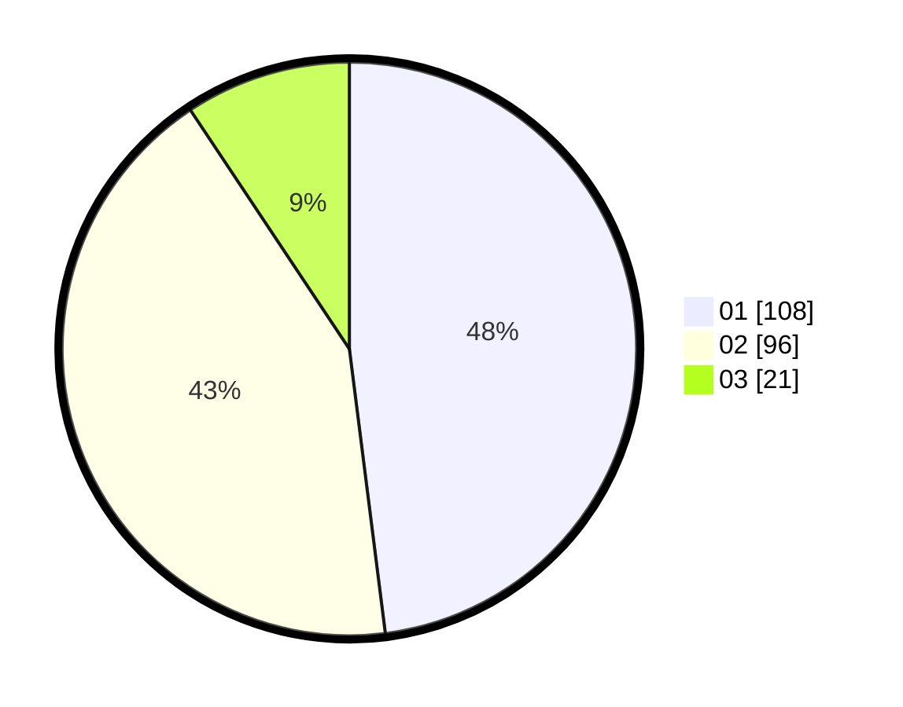

# Hasil

Hasil perolehan suara paslon dapat dilihat pada file paslon-01.txt, paslon-02.txt, dan paslon-03.txt.

Jika tidak ada, artinya data tersebut belum ada pada SIREKAP.

## Perolehan Suara

 * Paslon 01: **108**.
 * Paslon 02: **96**.
 * Paslon 03: **21**.

## Foto C Plano

https://sirekap-obj-formc.kpu.go.id/a321/pemilu/ppwp/31/74/01/10/05/3174011005050-20240214-184743--0407f058-f57d-49e5-abb2-fcc237bf1592.jpg

https://sirekap-obj-formc.kpu.go.id/a321/pemilu/ppwp/31/74/01/10/05/3174011005050-20240214-185220--bb97eac6-f98e-48da-b1e7-5945621cf6b9.jpg

https://sirekap-obj-formc.kpu.go.id/a321/pemilu/ppwp/31/74/01/10/05/3174011005050-20240214-184825--684072e9-7161-4a39-b6a1-7e2a510efe92.jpg

## DATA PEMILIH TETAP

Jumlah pemilih dalam DPT: **269**.
 * L: **139**.
 * P: **130**.

## DATA PENGGUNA HAK PILIH

Jumlah pengguna hak pilih dalam DPT: **226**.
 * L: **118**.
 * P: **108**.

Jumlah pengguna hak pilih dalam DPTb: **0**.
 * L: **0**.
 * P: **0**.

Jumlah pengguna hak pilih dalam DPK: **1**.
 * L: **1**.
 * P: **0**.

Jumlah pengguna hak pilih: **227**.
 * L: **119**.
 * P: **108**.

## JUMLAH SUARA SAH DAN TIDAK SAH

JUMLAH SELURUH SUARA SAH: **225**.

JUMLAH SUARA TIDAK SAH: **2**.

JUMLAH SELURUH SUARA SAH DAN SUARA TIDAK SAH: **227**.
