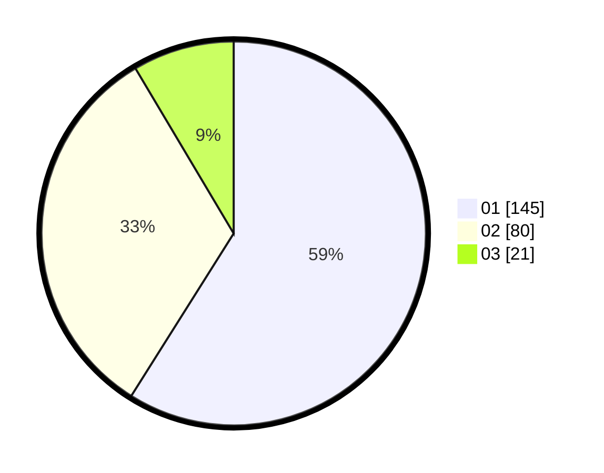

# Hasil

Hasil perolehan suara paslon dapat dilihat pada file paslon-01.txt, paslon-02.txt, dan paslon-03.txt.

Jika tidak ada, artinya data tersebut belum ada pada SIREKAP.

## Perolehan Suara

 * Paslon 01: **145**.
 * Paslon 02: **80**.
 * Paslon 03: **21**.

## Foto C Plano

https://sirekap-obj-formc.kpu.go.id/17cb/pemilu/ppwp/31/74/01/10/05/3174011005051-20240214-204659--ea018bfa-6882-4f2b-9d38-66f39aca46f8.jpg

https://sirekap-obj-formc.kpu.go.id/17cb/pemilu/ppwp/31/74/01/10/05/3174011005051-20240214-204423--1b74510c-dc4c-4a33-ad80-0c88eb16a73c.jpg

https://sirekap-obj-formc.kpu.go.id/17cb/pemilu/ppwp/31/74/01/10/05/3174011005051-20240214-204513--b1c959f7-b784-4407-bd00-ed26174733e4.jpg

## DATA PEMILIH TETAP

Jumlah pemilih dalam DPT: **273**.
 * L: **142**.
 * P: **131**.

## DATA PENGGUNA HAK PILIH

Jumlah pengguna hak pilih dalam DPT: **249**.
 * L: **129**.
 * P: **120**.

Jumlah pengguna hak pilih dalam DPTb: **0**.
 * L: **0**.
 * P: **0**.

Jumlah pengguna hak pilih dalam DPK: **0**.
 * L: **0**.
 * P: **0**.

Jumlah pengguna hak pilih: **249**.
 * L: **129**.
 * P: **120**.

## JUMLAH SUARA SAH DAN TIDAK SAH

JUMLAH SELURUH SUARA SAH: **246**.

JUMLAH SUARA TIDAK SAH: **3**.

JUMLAH SELURUH SUARA SAH DAN SUARA TIDAK SAH: **249**.
