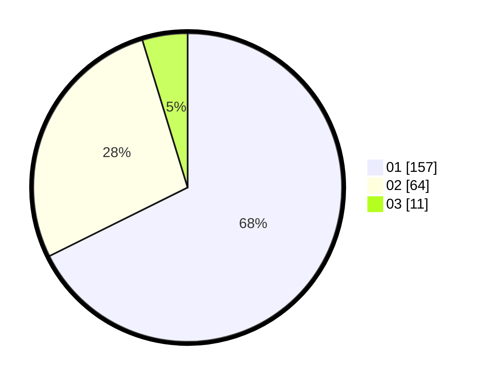

# Hasil

Hasil perolehan suara paslon dapat dilihat pada file paslon-01.txt, paslon-02.txt, dan paslon-03.txt.

Jika tidak ada, artinya data tersebut belum ada pada SIREKAP.

## Perolehan Suara

 * Paslon 01: **157**.
 * Paslon 02: **64**.
 * Paslon 03: **11**.

## Foto C Plano

https://sirekap-obj-formc.kpu.go.id/f247/pemilu/ppwp/31/74/01/10/05/3174011005054-20240214-185533--b9f41b0e-0551-4253-825b-236f0399014e.jpg

https://sirekap-obj-formc.kpu.go.id/f247/pemilu/ppwp/31/74/01/10/05/3174011005054-20240214-190052--432c9d67-6c7b-4635-85d7-174e6e92e73c.jpg

https://sirekap-obj-formc.kpu.go.id/f247/pemilu/ppwp/31/74/01/10/05/3174011005054-20240214-190210--21537cb9-6df5-4f1e-9e4b-e20dda715cac.jpg

## DATA PEMILIH TETAP

Jumlah pemilih dalam DPT: **264**.
 * L: **126**.
 * P: **138**.

## DATA PENGGUNA HAK PILIH

Jumlah pengguna hak pilih dalam DPT: **233**.
 * L: **109**.
 * P: **124**.

Jumlah pengguna hak pilih dalam DPTb: **3**.
 * L: **2**.
 * P: **1**.

Jumlah pengguna hak pilih dalam DPK: **1**.
 * L: **1**.
 * P: **0**.

Jumlah pengguna hak pilih: **237**.
 * L: **112**.
 * P: **125**.

## JUMLAH SUARA SAH DAN TIDAK SAH

JUMLAH SELURUH SUARA SAH: **232**.

JUMLAH SUARA TIDAK SAH: **5**.

JUMLAH SELURUH SUARA SAH DAN SUARA TIDAK SAH: **237**.
