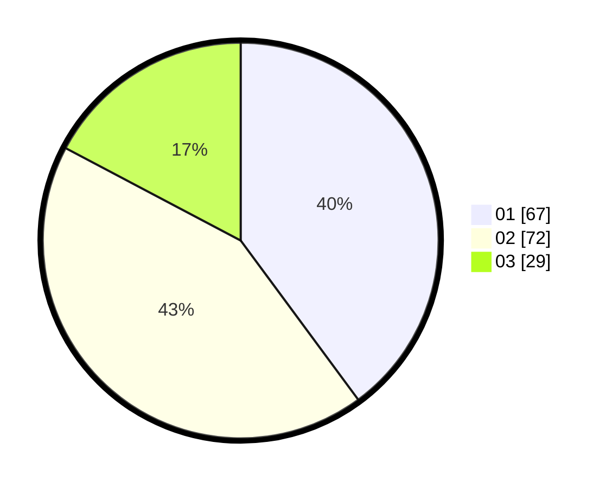

# Hasil

Hasil perolehan suara paslon dapat dilihat pada file paslon-01.txt, paslon-02.txt, dan paslon-03.txt.

Jika tidak ada, artinya data tersebut belum ada pada SIREKAP.

## Perolehan Suara

 * Paslon 01: **67**.
 * Paslon 02: **72**.
 * Paslon 03: **29**.

## Foto C Plano

https://sirekap-obj-formc.kpu.go.id/fc72/pemilu/ppwp/31/74/01/10/05/3174011005061-20240214-215648--dcb255ef-f543-4c38-9df5-8261532d429f.jpg

https://sirekap-obj-formc.kpu.go.id/fc72/pemilu/ppwp/31/74/01/10/05/3174011005061-20240214-215836--38148340-6807-45c4-95d2-36d599102237.jpg

https://sirekap-obj-formc.kpu.go.id/fc72/pemilu/ppwp/31/74/01/10/05/3174011005061-20240214-220023--c4abe93b-20d9-408e-9085-b5f8fa58d35f.jpg
