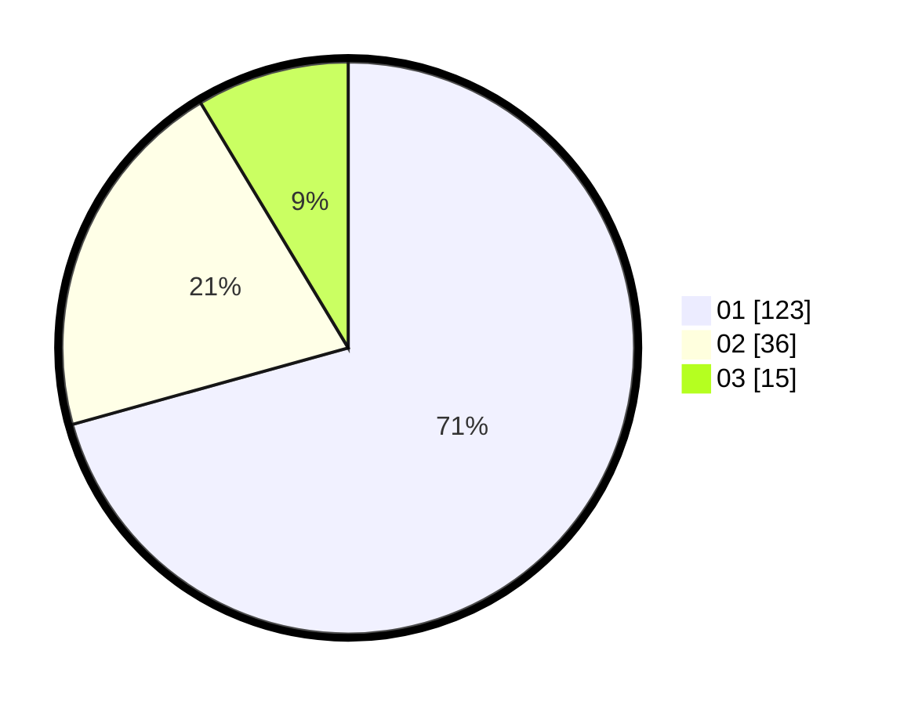

# Hasil

Hasil perolehan suara paslon dapat dilihat pada file paslon-01.txt, paslon-02.txt, dan paslon-03.txt.

Jika tidak ada, artinya data tersebut belum ada pada SIREKAP.

## Perolehan Suara

 * Paslon 01: **123**.
 * Paslon 02: **36**.
 * Paslon 03: **15**.

## Foto C Plano

https://sirekap-obj-formc.kpu.go.id/749c/pemilu/ppwp/31/74/01/10/05/3174011005063-20240216-144708--eacfc5d2-c9f2-49dc-ba03-7f9fb84c7559.jpg

https://sirekap-obj-formc.kpu.go.id/749c/pemilu/ppwp/31/74/01/10/05/3174011005063-20240216-144709--11ad0a9b-6505-4617-9514-83932291935c.jpg

https://sirekap-obj-formc.kpu.go.id/749c/pemilu/ppwp/31/74/01/10/05/3174011005063-20240216-144708--b87592e5-86f0-4b83-ba34-4d3f0e9e8b7b.jpg

## DATA PEMILIH TETAP

Jumlah pemilih dalam DPT: **204**.
 * L: **100**.
 * P: **104**.

## DATA PENGGUNA HAK PILIH

Jumlah pengguna hak pilih dalam DPT: **171**.
 * L: **75**.
 * P: **96**.

Jumlah pengguna hak pilih dalam DPTb: **6**.
 * L: **4**.
 * P: **2**.

Jumlah pengguna hak pilih dalam DPK: **0**.
 * L: **0**.
 * P: **0**.

Jumlah pengguna hak pilih: **177**.
 * L: **79**.
 * P: **98**.

## JUMLAH SUARA SAH DAN TIDAK SAH

JUMLAH SELURUH SUARA SAH: **174**.

JUMLAH SUARA TIDAK SAH: **3**.

JUMLAH SELURUH SUARA SAH DAN SUARA TIDAK SAH: **177**.
